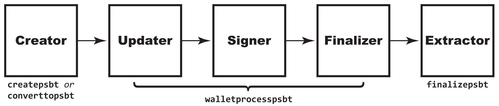
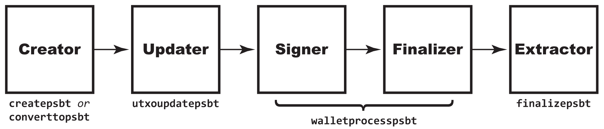

# 7.1: Creare una Transazione Bitcoin Parzialmente Firmata

> :information_source: **NOTA:** Questa sezione è stata aggiunta di recente al corso ed è una bozza iniziale che potrebbe essere ancora in attesa di revisione. Lettore avvertito.

Le transazioni Bitcoin parzialmente firmate (PSBT) sono il modo più nuovo per variare la creazione di transazioni basilari di Bitcoin. Lo fanno introducendo la collaborazione in ogni fase del processo, consentendo alle persone (o ai programmi) non solo di autenticare le transazioni insieme (come con i multisig), ma anche di creare, finanziare e trasmettere facilmente in modo collaborativo.

> :avviso: **AVVISO VERSIONE:** Questa è un'innovazione di Bitcoin Core v 0.17.0. Le versioni precedenti di Bitcoin Core non saranno in grado di funzionare con il processo di PSBT mentre è in corso (sebbene saranno comunque in grado di riconoscere la transazione finale). Alcuni aggiornamenti e upgrade per le PSBT sono continuati fino alla versione 0.20.0.

## Scoprire come funzionano le PSBT

Le `multisig` erano ottime per il caso molto specifico di detenzione congiunta di fondi e di definizione di regole per chi tra i firmatari congiunti potesse autenticare l’uso di tali fondi. Esistono molti casi d'uso, come ad esempio: un conto bancario congiunto con il proprio coniuge (una firma 1 su 2); un requisito fiduciario per il doppio controllo (una firma 2 su 2); e un deposito a garanzia (una firma 2 su 3).

> :book: ***Cos'è un PSBT?*** Come suggerisce il nome, un PSBT è una transazione che non è stata completamente firmata. Questo è importante, perché una volta firmata una transazione, il suo contenuto viene bloccato. [BIP174](https://github.com/bitcoin/bips/blob/master/bip-0174.mediawiki) ha definito una metodologia astratta per mettere insieme i PSBT che descrive e standardizza i ruoli nella loro creazione collaborativa. Un *Creatore* propone una transazione; uno o più *Aggiornatori* lo integrano; e uno o più *Firmatari* lo autenticano; prima che un *Finalizatore* lo completi; e un *Estrattore* la trasforma in una transazione per la rete Bitcoin. Potrebbe anche esserci un *Combinatore* che unisce PSBT paralleli di utenti diversi.

Inizialmente le PSBT potrebbero sembrare simili ai multi-sigs perché hanno un funzionalità in comune: la capacità di firmare congiuntamente una transazione. Tuttavia, sono stati creati per un caso d’uso completamente diverso. Le PSBT riconoscono la necessità che più programmi creino congiuntamente una transazione per una serie di ragioni diverse e forniscono un formato regolarizzato per farlo. Sono particolarmente utili per i casi d'uso che coinvolgono portafogli hardware (Gurda qui nel [Capitolo 7.3](07_3_Integrazione_con_Hardware_Wallets.md)), che sono protetti dall'accesso completo a Internet e tendono ad avere una cronologia delle transazioni minima.

In generale, le PSBT forniscono una serie di elementi funzionali che migliorano questo caso d'uso:

1. Forniscono uno _standard_ per la creazione collaborativa di transazioni, mentre le metodologie precedenti (inclusa quella multi-sig del [capitolo 6](06_0_Ampliare_le_Transazioni_Bitcoin_con_Multifirme.md) ) dipendevano dall'implementazione.
2. Supportano una _più ampia varietà di casi d'uso_, compreso il semplice finanziamento congiunto.
3. Supportano _portafogli hardware_ e altri casi in cui un nodo potrebbe non avere una cronologia completa delle transazioni.
4. Consentono facoltativamente la combinazione di _transazioni non serializzate_, senza richiedere il passaggio di un codice esadecimale sempre più grande da utente a utente.

I PSBT svolgono il loro lavoro integrando le normali informazioni sulle transazioni con una serie di input e output, ognuno dei quali definisce tutto ciò che è necessario sapere su tali UTXO, in modo che anche un portafoglio airgap possa prendere una decisione informata sulle firme. Pertanto, un input elenca la quantità di denaro in un UTXO e cosa è necessario fare per spenderlo, mentre un output fa lo stesso per gli UTXO che sta creando.

Questa prima sezione descriverà il processo PSBT standard di: Creatore, Aggiornatore, Firmatario, Finalizzatore, Estrattore. Lo farà da una sola macchina, il che lo farà sembrare un modo contorto per creare una transazione grezza. Ma abbi fede, c'è uno scopo in questo! Il [Capitolo 7.2](07_2_Usare_una_Transazione_Bitcoin_Parzialmente_Firmata.md) e il [Capitolo 7.3](07_3_Integrazione_con_Hardware_Wallets.md) mostreranno alcuni esempi reali di utilizzo dei PSBT e trasformeranno questo semplice sistema in un processo collaborativo condiviso tra più macchine che ha effetti reali e crea reali opportunità.

## Creare una PSBT alla vecchia maniera
#### Ruolo PSBT: Creatore

Il modo più semplice per creare un PSBT è prendere una transazione esistente e utilizzare `converttopsbt` per trasformarla in un PSBT. Questo non è certamente il modo _migliore_ poiché richiede di effettuare una transazione per un formato (una transazione grezza) e poi convertirla in un altro (PSBT), ma se hai un vecchio software che può generare solo una transazione grezza, potresti dover farlo.

Crei semplicemente la tua transazione grezza normalmente:

```
$ utxo_txid_1=$(bitcoin-cli listunspent | jq -r '.[0] | .txid')
$ utxo_vout_1=$(bitcoin-cli listunspent | jq -r '.[0] | .vout')
$ utxo_txid_2=$(bitcoin-cli listunspent | jq -r '.[1] | .txid')
$ utxo_vout_2=$(bitcoin-cli listunspent | jq -r '.[1] | .vout')
$ echo $utxo_txid_1 $utxo_vout_1 $utxo_txid_2 $utxo_vout_2
c6de60427b28d8ec8102e49771e5d0348fc3ef6a5bf02eb864ec745105a6951b 1 8748eff5f12ca886e3603d9e30227dcb3f0332e0706c4322fec96001f7c7f41c 0
$ recipient=tb1qcaedd724gts3aug73m78c7nfsv9d8zs9q6h2kd
$ rawtxhex=$(bitcoin-cli -named createrawtransaction inputs='''[ { "txid": "'$utxo_txid_1'", "vout": '$utxo_vout_1' }, { "txid": "'$utxo_txid_2'", "vout": '$utxo_vout_2' } ]''' outputs='''{ "'$recipient'": 0.0000065 }''')
```
Quindi lo converti:
```
$ psbt=$(bitcoin-cli -named converttopsbt hexstring=$rawtxhex)
$ echo $psbt
cHNidP8BAHsCAAAAAhuVpgVRdOxkuC7wW2rvw4800OVxl+QCgezYKHtCYN7GAQAAAAD/////HPTH9wFgyf4iQ2xw4DIDP8t9IjCePWDjhqgs8fXvSIcAAAAAAP////8BigIAAAAAAAAWABTHctb5VULhHvEejvx8emmDCtOKBQAAAAAAAAAA
```
Noterai che la codifica PSBT appare molto diversa dall'esadecimale della transazione.

Ma se puoi, crea direttamente il PSBT ...

## Crea un PSBT nel modo più difficile

#### Ruolo PSBT: Creatore

La prima metodologia per creare un PSBT senza passare attraverso un altro formato è l'equivalente PSBT di `createrawtransaction`. Si chiama `createpsbt` e ti dà il massimo controllo al costo della massimo lavoro e della massima provabilità di errore.

La CLI dovrebbe sembrare abbastanza familiare, unica differenza, un nuovo comando RPC:

```
$ psbt_1=$(bitcoin-cli -named createpsbt inputs='''[ { "txid": "'$utxo_txid_1'", "vout": '$utxo_vout_1' }, { "txid": "'$utxo_txid_2'", "vout": '$utxo_vout_2' } ]''' outputs='''{ "'$recipient'": 0.0000065 }''')
```
Il team di Bitcoin Core si è assicurato che `createpsbt` funzionasse in modo molto simile a `createrawtransaction`, quindi non è necessario imparare un nuovo formato di creazione.

Puoi verificare che la nuova PSBT sia uguale a quella creata da `converttopsbt`:

```
$ echo $psbt_1
cHNidP8BAHsCAAAAAhuVpgVRdOxkuC7wW2rvw4800OVxl+QCgezYKHtCYN7GAQAAAAD/////HPTH9wFgyf4iQ2xw4DIDP8t9IjCePWDjhqgs8fXvSIcAAAAAAP////8BigIAAAAAAAAWABTHctb5VULhHvEejvx8emmDCtOKBQAAAAAAAAAA
$ if [ "$psbt" == "$psbt_1" ]; then     echo "PSBTs are equal"; else     echo "PSBTs are not equal"; fi
PSBTs are equal
```

## Esaminare una PSBT

#### Ruolo PSBT: Qualsiasi ruolo

Allora, che aspetto ha effettivamente il tuo PSBT? Puoi vederlo con il comando `decodepsbt`:

```
$ bitcoin-cli -named decodepsbt psbt=$psbt
{
  "tx": {
    "txid": "ea73a631b456d2b041ed73bf5767946408c6ff067716929a68ecda2e3e4de6d3",
    "hash": "ea73a631b456d2b041ed73bf5767946408c6ff067716929a68ecda2e3e4de6d3",
    "version": 2,
    "size": 123,
    "vsize": 123,
    "weight": 492,
    "locktime": 0,
    "vin": [
      {
        "txid": "c6de60427b28d8ec8102e49771e5d0348fc3ef6a5bf02eb864ec745105a6951b",
        "vout": 1,
        "scriptSig": {
          "asm": "",
          "hex": ""
        },
        "sequence": 4294967295
      },
      {
        "txid": "8748eff5f12ca886e3603d9e30227dcb3f0332e0706c4322fec96001f7c7f41c",
        "vout": 0,
        "scriptSig": {
          "asm": "",
          "hex": ""
        },
        "sequence": 4294967295
      }
    ],
    "vout": [
      {
        "value": 0.00000650,
        "n": 0,
        "scriptPubKey": {
          "asm": "0 c772d6f95542e11ef11e8efc7c7a69830ad38a05",
          "hex": "0014c772d6f95542e11ef11e8efc7c7a69830ad38a05",
          "reqSigs": 1,
          "type": "witness_v0_keyhash",
          "addresses": [
            "tb1qcaedd724gts3aug73m78c7nfsv9d8zs9q6h2kd"
          ]
        }
      }
    ]
  },
  "unknown": {
  },
  "inputs": [
    {
    },
    {
    }
  ],
  "outputs": [
    {
    }
  ]
}
```

È importante notare che anche se abbiamo definito i fondamenti della transazione: i `vin` da cui proviene il denaro e i `vouts` del destino, non abbiamo ancora definito gli `input` e gli `input` `output` che costituiscono il cuore di una PSBT e che sono necessari agli utenti offline per valutarli. Questo è previsto: il ruolo del Creatore come definito in [BIP174](https://github.com/bitcoin/bips/blob/master/bip-0174.mediawiki) è quello di delineare la transazione, mentre il ruolo dell'Updater, _l'aggiornatore_,  è iniziare a compilare i dati specifici del PSBT. (Altri comandi combinano i ruoli Creator e Updater, ma `createpsbt` no perché non ha accesso al tuo portafoglio.)

Puoi anche usare il comando `analyzepsbt` per vedere il suo stato attuale:

```
standup@btctest20:~$ bitcoin-cli -named analyzepsbt psbt=$psbt
{
  "inputs": [
    {
      "has_utxo": false,
      "is_final": false,
      "next": "updater"
    },
    {
      "has_utxo": false,
      "is_final": false,
      "next": "updater"
    }
  ],
  "next": "updater"
}
```
Allo stesso modo, `analyzepsbt` ci mostra una PSBT che necessita ancora di lavoro. Diamo un'occhiata a ciascuno dei due `input` (corrispondenti ai due `vin`) e nessuno dei due ha le informazioni di cui ha bisogno.

## Finalizza un PSBT
#### Ruolo PSBT: Aggiornatore, Firmatario, Finalizzatore

Esiste un comando `utxoupdatepsbt` che può essere utilizzato per aggiornare gli UTXO, importando manualmente le informazioni sul descrittore, ma non vuoi usarlo a meno che tu non abbia un caso d'uso in cui non hai tutte queste informazioni nei portafogli di tutti coloro che firmeranno il PSBT.

> :information_source: **NOTA:** Se scegli di aggiornare il PSBT con `utxoupdatepsbt`, dovrai comunque utilizzare `walletprocesspsbt` per firmarlo: è l'unico comando con ruolo firmatario per PSBT disponibile in `bitcoin- cli`.

Dovresti invece utilizzare `walletprocesspsbt`, che aggiornerà, firmerà e finalizzerà:

```
$ bitcoin-cli walletprocesspsbt $psbt
{
  "psbt": "cHNidP8BAHsCAAAAAhuVpgVRdOxkuC7wW2rvw4800OVxl+QCgezYKHtCYN7GAQAAAAD/////HPTH9wFgyf4iQ2xw4DIDP8t9IjCePWDjhqgs8fXvSIcAAAAAAP////8BigIAAAAAAAAWABTHctb5VULhHvEejvx8emmDCtOKBQAAAAAAAQEfAQAAAAAAAAAWABRsRdOvqHYghsS9dtinGsfJduGRlgEIawJHMEQCIAqJbxz6dBzNpfaDu4XZXb+DbDkM3UWnhezh9UdmeVghAiBRxMlW2o0wEtphtUZRWIiJOaGtXfsQbB4lovkvE4eRIgEhArrDpkX9egpTfGJ6039faVBYxY0ZzrADPpE/Gpl14A3uAAEBH0gDAAAAAAAAFgAU1ZEJG4B0ojde2ZhanEsY7+z9QWUBCGsCRzBEAiB+sNNCO4xiFQ+DoHVrqqk9yM0V4H9ZSyExx1PW7RbjsgIgUeWkQ3L7aAv1xIe7h+8PZb8ECsXg1UzbtPW8wd2qx0UBIQKIO7VGPjfVUlLYs9XCFBsAezfIp9tiEfdclVrMXqMl6wAA",
  "complete": true
}
```
Ovviamente, dovrai salvare le informazioni `psbt` utilizzando `jq`:

```
$ psbt_f=$(bitcoin-cli walletprocesspsbt $psbt | jq -r '.psbt')
```

Puoi vedere che gli `input` sono stati compilati:

```
$ bitcoin-cli decodepsbt $psbt_f
{
  "tx": {
    "txid": "ea73a631b456d2b041ed73bf5767946408c6ff067716929a68ecda2e3e4de6d3",
    "hash": "ea73a631b456d2b041ed73bf5767946408c6ff067716929a68ecda2e3e4de6d3",
    "version": 2,
    "size": 123,
    "vsize": 123,
    "weight": 492,
    "locktime": 0,
    "vin": [
      {
        "txid": "c6de60427b28d8ec8102e49771e5d0348fc3ef6a5bf02eb864ec745105a6951b",
        "vout": 1,
        "scriptSig": {
          "asm": "",
          "hex": ""
        },
        "sequence": 4294967295
      },
      {
        "txid": "8748eff5f12ca886e3603d9e30227dcb3f0332e0706c4322fec96001f7c7f41c",
        "vout": 0,
        "scriptSig": {
          "asm": "",
          "hex": ""
        },
        "sequence": 4294967295
      }
    ],
    "vout": [
      {
        "value": 0.00000650,
        "n": 0,
        "scriptPubKey": {
          "asm": "0 c772d6f95542e11ef11e8efc7c7a69830ad38a05",
          "hex": "0014c772d6f95542e11ef11e8efc7c7a69830ad38a05",
          "reqSigs": 1,
          "type": "witness_v0_keyhash",
          "addresses": [
            "tb1qcaedd724gts3aug73m78c7nfsv9d8zs9q6h2kd"
          ]
        }
      }
    ]
  },
  "unknown": {
  },
  "inputs": [
    {
      "witness_utxo": {
        "amount": 0.00000001,
        "scriptPubKey": {
          "asm": "0 6c45d3afa8762086c4bd76d8a71ac7c976e19196",
          "hex": "00146c45d3afa8762086c4bd76d8a71ac7c976e19196",
          "type": "witness_v0_keyhash",
          "address": "tb1qd3za8tagwcsgd39awmv2wxk8e9mwryvktqmkkg"
        }
      },
      "final_scriptwitness": [
        "304402200a896f1cfa741ccda5f683bb85d95dbf836c390cdd45a785ece1f54766795821022051c4c956da8d3012da61b5465158888939a1ad5dfb106c1e25a2f92f1387912201",
        "02bac3a645fd7a0a537c627ad37f5f695058c58d19ceb0033e913f1a9975e00dee"
      ]
    },
    {
      "witness_utxo": {
        "amount": 0.00000840,
        "scriptPubKey": {
          "asm": "0 d591091b8074a2375ed9985a9c4b18efecfd4165",
          "hex": "0014d591091b8074a2375ed9985a9c4b18efecfd4165",
          "type": "witness_v0_keyhash",
          "address": "tb1q6kgsjxuqwj3rwhkenpdfcjccalk06st9z0k0kh"
        }
      },
      "final_scriptwitness": [
        "304402207eb0d3423b8c62150f83a0756baaa93dc8cd15e07f594b2131c753d6ed16e3b2022051e5a44372fb680bf5c487bb87ef0f65bf040ac5e0d54cdbb4f5bcc1ddaac74501",
        "02883bb5463e37d55252d8b3d5c2141b007b37c8a7db6211f75c955acc5ea325eb"
      ]
    }
  ],
  "outputs": [
    {
    }
  ],
  "fee": 0.00000191
}
```
O per essere più precisi: (1) la PSBT è stata aggiornata con le informazioni `witness_utxo`; (2) la PSBT è stata firmata; e (3) la PSBT è stata finalizzata.


## Crea una PSBT in modo semplice
#### Ruolo PSBT: Creatore, Aggiornatore

Se pensi che dovrebbe esserci un comando equivalente a `fundrawtransaction`, sarai felice di sapere che esiste: `walletcreatefundedpsbt`. Potresti usarlo proprio come `createpsbt`:

```
$ bitcoin-cli -named walletcreatefundedpsbt inputs='''[ { "txid": "'$utxo_txid_1'", "vout": '$utxo_vout_1' }, { "txid": "'$utxo_txid_2'", "vout": '$utxo_vout_2' } ]''' outputs='''{ "'$recipient'": 0.0000065 }'''
{
  "psbt": "cHNidP8BAOwCAAAABBuVpgVRdOxkuC7wW2rvw4800OVxl+QCgezYKHtCYN7GAQAAAAD/////HPTH9wFgyf4iQ2xw4DIDP8t9IjCePWDjhqgs8fXvSIcAAAAAAP/////uFwerANKjyVK6WaR7gzlX+lOf+ORsfjP5LYCSNIbhaAAAAAAA/v///4XjOeey0NyGpJYpszNWF8AFNiuFaWsjkOrk35Jp+9kKAAAAAAD+////AtYjEAAAAAAAFgAUMPsier2ey1eH48oGqrbbYGzNHgKKAgAAAAAAABYAFMdy1vlVQuEe8R6O/Hx6aYMK04oFAAAAAAABAR8BAAAAAAAAABYAFGxF06+odiCGxL122Kcax8l24ZGWIgYCusOmRf16ClN8YnrTf19pUFjFjRnOsAM+kT8amXXgDe4Q1gQ4AAAAAIABAACADgAAgAABAR9IAwAAAAAAABYAFNWRCRuAdKI3XtmYWpxLGO/s/UFlIgYCiDu1Rj431VJS2LPVwhQbAHs3yKfbYhH3XJVazF6jJesQ1gQ4AAAAAIABAACADAAAgAABAIwCAAAAAdVmsvkSBmfeHqNAe/wDCQ5lEp9F/587ftzCD1UL60nMAQAAABcWABRzFxRJfFPl8FJ6SxjAJzy3mCAMXf7///8CQEIPAAAAAAAZdqkUf0NzebzGbEB0XtwYkeprODDhl12IrMEwLQAAAAAAF6kU/d+kMX6XijmD+jWdUrLZlJUnH2iHPhQbACIGA+/e40wACf0XXzsgteWlUX/V0WdG8uY1tEYXra/q68OIENYEOAAAAACAAAAAgBIAAIAAAQEfE4YBAAAAAAAWABTVkQkbgHSiN17ZmFqcSxjv7P1BZSIGAog7tUY+N9VSUtiz1cIUGwB7N8in22IR91yVWsxeoyXrENYEOAAAAACAAQAAgAwAAIAAIgICKMavAB+71Adqsbf+XtC1g/OlmLEuTp3U0axyeu/LAI0Q1gQ4AAAAAIABAACAGgAAgAAA",
  "fee": 0.00042300,
  "changepos": 0
}
```
Tuttavia, il grande vantaggio è che puoi usarlo per autofinanziarti tralasciando gli `input`, proprio come `fundrawtransaction`.
```
$ psbt_new=$(bitcoin-cli -named walletcreatefundedpsbt inputs='''[]''' outputs='''{ "'$recipient'": 0.0000065 }''' | jq -r '.psbt')
$ bitcoin-cli decodepsbt $psbt_new
{
  "tx": {
    "txid": "9f2c6205ac797c1020f7f261e3ab71cd0699ff4b1a8934f68b273c71547e235f",
    "hash": "9f2c6205ac797c1020f7f261e3ab71cd0699ff4b1a8934f68b273c71547e235f",
    "version": 2,
    "size": 154,
    "vsize": 154,
    "weight": 616,
    "locktime": 0,
    "vin": [
      {
        "txid": "8748eff5f12ca886e3603d9e30227dcb3f0332e0706c4322fec96001f7c7f41c",
        "vout": 0,
        "scriptSig": {
          "asm": "",
          "hex": ""
        },
        "sequence": 4294967294
      },
      {
        "txid": "68e1863492802df9337e6ce4f89f53fa5739837ba459ba52c9a3d200ab0717ee",
        "vout": 0,
        "scriptSig": {
          "asm": "",
          "hex": ""
        },
        "sequence": 4294967294
      }
    ],
    "vout": [
      {
        "value": 0.00971390,
        "n": 0,
        "scriptPubKey": {
          "asm": "0 09a74ef0bae4d68b0b2ec9a7c4557a2b5c85bd8b",
          "hex": "001409a74ef0bae4d68b0b2ec9a7c4557a2b5c85bd8b",
          "reqSigs": 1,
          "type": "witness_v0_keyhash",
          "addresses": [
            "tb1qpxn5au96untgkzewexnug4t69dwgt0vtfahcv6"
          ]
        }
      },
      {
        "value": 0.00000650,
        "n": 1,
        "scriptPubKey": {
          "asm": "0 c772d6f95542e11ef11e8efc7c7a69830ad38a05",
          "hex": "0014c772d6f95542e11ef11e8efc7c7a69830ad38a05",
          "reqSigs": 1,
          "type": "witness_v0_keyhash",
          "addresses": [
            "tb1qcaedd724gts3aug73m78c7nfsv9d8zs9q6h2kd"
          ]
        }
      }
    ]
  },
  "unknown": {
  },
  "inputs": [
    {
      "witness_utxo": {
        "amount": 0.00000840,
        "scriptPubKey": {
          "asm": "0 d591091b8074a2375ed9985a9c4b18efecfd4165",
          "hex": "0014d591091b8074a2375ed9985a9c4b18efecfd4165",
          "type": "witness_v0_keyhash",
          "address": "tb1q6kgsjxuqwj3rwhkenpdfcjccalk06st9z0k0kh"
        }
      },
      "bip32_derivs": [
        {
          "pubkey": "02883bb5463e37d55252d8b3d5c2141b007b37c8a7db6211f75c955acc5ea325eb",
          "master_fingerprint": "d6043800",
          "path": "m/0'/1'/12'"
        }
      ]
    },
    {
      "non_witness_utxo": {
        "txid": "68e1863492802df9337e6ce4f89f53fa5739837ba459ba52c9a3d200ab0717ee",
        "hash": "68e1863492802df9337e6ce4f89f53fa5739837ba459ba52c9a3d200ab0717ee",
        "version": 2,
        "size": 140,
        "vsize": 140,
        "weight": 560,
        "locktime": 1774654,
        "vin": [
          {
            "txid": "cc49eb0b550fc2dc7e3b9fff459f12650e0903fc7b40a31ede670612f9b266d5",
            "vout": 1,
            "scriptSig": {
              "asm": "0014731714497c53e5f0527a4b18c0273cb798200c5d",
              "hex": "160014731714497c53e5f0527a4b18c0273cb798200c5d"
            },
            "sequence": 4294967294
          }
        ],
        "vout": [
          {
            "value": 0.01000000,
            "n": 0,
            "scriptPubKey": {
              "asm": "OP_DUP OP_HASH160 7f437379bcc66c40745edc1891ea6b3830e1975d OP_EQUALVERIFY OP_CHECKSIG",
              "hex": "76a9147f437379bcc66c40745edc1891ea6b3830e1975d88ac",
              "reqSigs": 1,
              "type": "pubkeyhash",
              "addresses": [
                "ms7ruzvL4atCu77n47dStMb3of6iScS8kZ"
              ]
            }
          },
          {
            "value": 0.02961601,
            "n": 1,
            "scriptPubKey": {
              "asm": "OP_HASH160 fddfa4317e978a3983fa359d52b2d99495271f68 OP_EQUAL",
              "hex": "a914fddfa4317e978a3983fa359d52b2d99495271f6887",
              "reqSigs": 1,
              "type": "scripthash",
              "addresses": [
                "2NGParh82hE2Zif5PVK3AfLpYhfwF5FyRGr"
              ]
            }
          }
        ]
      },
      "bip32_derivs": [
        {
          "pubkey": "03efdee34c0009fd175f3b20b5e5a5517fd5d16746f2e635b44617adafeaebc388",
          "master_fingerprint": "d6043800",
          "path": "m/0'/0'/18'"
        }
      ]
    }
  ],
  "outputs": [
    {
      "bip32_derivs": [
        {
          "pubkey": "029bb586a52657dd98852cecef78552a4e21d081a7a30e4008ce9b419840d4deac",
          "master_fingerprint": "d6043800",
          "path": "m/0'/1'/27'"
        }
      ]
    },
    {
    }
  ],
  "fee": 0.00028800
}
```
Come puoi vedere, ha creato la PSBT e poi l'ha aggiornata con tutte le informazioni che ha potuto trovare localmente.

Da lì, devi utilizzare `walletprocesspsbt` per finalizzare, come al solito:

```
$ psbt_new_f=$(bitcoin-cli walletprocesspsbt $psbt_new | jq -r '.psbt')
```

Successivamente, un'analisi mostrerà che anche questo è quasi pronto:

```
$ bitcoin-cli analyzepsbt $psbt_new_f
{
  "inputs": [
    {
      "has_utxo": true,
      "is_final": true,
      "next": "extractor"
    },
    {
      "has_utxo": true,
      "is_final": true,
      "next": "extractor"
    }
  ],
  "estimated_vsize": 288,
  "estimated_feerate": 0.00100000,
  "fee": 0.00028800,
  "next": "extractor"
}
```
Ora vorresti davvero utilizzare `walletcreatefundedpsbt` se stessi creando un programma `bitcoin-cli`? Probabilmente no. Ma è la stessa analisi dell'utilizzo di `fundrawtransaction`. Lascia che Bitcoin Core esegua l'analisi, i calcoli e le decisioni o lo farai tu?

## Invia una PSBT
#### Ruolo PSBT: Estrattore

Per finalizzare la PSBT, usa `finalizepsbt`, che trasformerà nuovamente il tuo PSBT in esadecimale. (Assumerà anche il ruolo di Finalizzatore, se ciò non è già accaduto.)
```
$ bitcoin-cli finalizepsbt $psbt_f
{
  "hex": "020000000001021b95a6055174ec64b82ef05b6aefc38f34d0e57197e40281ecd8287b4260dec60100000000ffffffff1cf4c7f70160c9fe22436c70e032033fcb7d22309e3d60e386a82cf1f5ef48870000000000ffffffff018a02000000000000160014c772d6f95542e11ef11e8efc7c7a69830ad38a050247304402200a896f1cfa741ccda5f683bb85d95dbf836c390cdd45a785ece1f54766795821022051c4c956da8d3012da61b5465158888939a1ad5dfb106c1e25a2f92f13879122012102bac3a645fd7a0a537c627ad37f5f695058c58d19ceb0033e913f1a9975e00dee0247304402207eb0d3423b8c62150f83a0756baaa93dc8cd15e07f594b2131c753d6ed16e3b2022051e5a44372fb680bf5c487bb87ef0f65bf040ac5e0d54cdbb4f5bcc1ddaac745012102883bb5463e37d55252d8b3d5c2141b007b37c8a7db6211f75c955acc5ea325eb00000000",
  "complete": true
}
```
Come al solito, ti consigliamo di salvarlo e quindi di inviarlo

```
$ psbt_hex=$(bitcoin-cli finalizepsbt $psbt_f | jq -r '.hex')
$ bitcoin-cli -named sendrawtransaction hexstring=$psbt_hex
ea73a631b456d2b041ed73bf5767946408c6ff067716929a68ecda2e3e4de6d3
```
## Il flusso di lavoro

Quando crei software per `bitcoin-cli`, è molto probabile che ricoprirai i cinque ruoli principali dei PSBT con `createpsbt`, `walletprocesspsbt` e `finalizepsbt`. Ecco come appare il flusso:



Se scegli di utilizzare la scorciatoia `walletcreatefundedpsbt`, ecco come appare:


Infine, se invece hai bisogno di maggiore controllo e scegli di utilizzare `utxoupdatepsbt` (che non è molto documentato qui), hai invece questo flusso di lavoro:



## Riepilogo: creare una transazione Bitcoin parzialmente firmata

La creazione di una PSBT implica un flusso di lavoro piuttosto complesso di creazione, aggiornamento, firma, finalizzazione ed estrazione di una PSBT, dopo di che viene riconvertita in una transazione grezza. Perché dovresti prenderti tutto quel disturbo? Perché vuoi collaborare tra più utenti o più programmi. Ora che hai compreso questo flusso di lavoro, la sezione successiva presenta alcuni esempi reali di come farlo.

## Qual è il prossimo argomento?

Continua con "Ampliare le transazioni Bitcoin usando PSBT" nel [Capitolo 7.2: Usare una Transazione Bitcoin Parzialmente Firmata](07_2_Usare_una_Transazione_Bitcoin_Parzialmente_Firmata.md).
