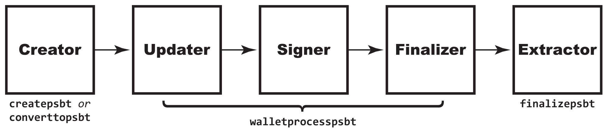
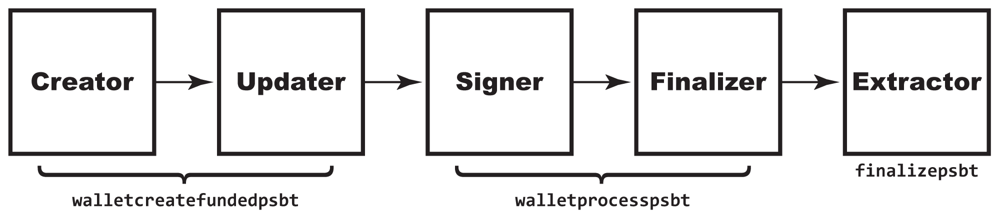
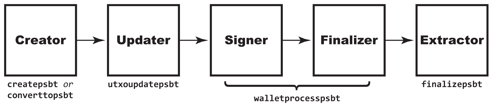

# 8.2: Understanding the PSBT Process

Partially Signed Bitcoin Transactions (PSBTs) are the newest way to vary the creation of basic Bitcoin transactions. We used them in the last section to spend a multisig, but they have a number of other use cases. Before we dive into those in the next section, we're first going to review many of the basics of PSBTs that we glossed past in the previous section: the roles and the process, including a few new `bitcoin-cli` commands.

## Understand the PSBT: The Rest of the Story

Multisignatures are great for the very specific situation of jointly holding funds and setting rules for whom among the joint signers can authenticate the use of those funds. There are many use cases, such as: a spousal joint bank account (a 1-of-2 multisig); a fiduciary requirement for dual control (a 2-of-2 multisig); and an escrow (a 2-of-3 multisig). 

PSBTs may initially look sort of the same as multisigs because they have a single overlapping bit of functionality: the ability to jointly sign a transaction. However, they were created for a totally different use case. PSBTs recognize the need for multiple programs to jointly create a transaction for a number of different reasons, and they provide a regularized format for doing so. They're especially useful for use cases involving hardware wallets (for which, see [§8.5](https://github.com/BlockchainCommons/Learning-Bitcoin-from-the-Command-Line/blob/master/08_5_Integrating_with_Hardware_Wallets.md)), which are protected from full access to the internet and so tend to have minimal transaction history.

In general, PSBTs provide a number of functional elements that improve the use case of collaborative transaction creation:

1. They provide a _standard_ for collaboratively creating transactions, whereas previous methodologies (including the multisig one from the previous chapter) were implementation dependent.
2. They support a _wider variety of use cases_, including simple joint funding.
3. They support _hardware wallets_ and other cases where a node may not have full transaction history.
4. They optionally allow for the combination of _non-serialized transactions_ rather than requiring an ever-bigger hex code to be passed from user to user.

PSBTs do their work by supplementing normal transaction information with a set of inputs and outputs, each of which defines everything you need to know about those UTXOs, so that even an airgapped wallet can make an informed decision about signatures. Thus, an input lists out the amount of money in a UTXO and what needs to be done to spend it, while an output does the same for the UTXOs it's creating.

> :book: ***What is a PSBT?*** As the name suggests, a PSBT is a transaction that has not been fully signed. That's important, because once a transaction is signed, its content is locked in. [BIP174](https://github.com/bitcoin/bips/blob/master/bip-0174.mediawiki) defined an abstracted methodology for putting PSBTs together that describes and standardizes roles in their collaborative creation. A *Creator* proposes a transaction; one or more *Updaters* supplement it; and one or more *Signers* authenticate it; before a *Finalizer* completes it; and an *Extracter* turns it into a transaction for the Bitcoin network. There may also be a *Combiner* who merges parallel PSBTs from different users. 

This section will expand on the use of the standard PSBT roles (Creator, Updater, Signer, Finalizer, Extractor) and the various RPC functions that can be used to work with PSBTs. [§8.3](08_3_Using_a_Partially_Signed_Bitcoin_Transaction.md) and [§8.5](08_5_Integrating_with_Hardware_Wallets.md) will then demonstrate some additional real-life examples of using PSBTs for a variety of purposes.

## Review the Hand Creation Process

Our multsig example in the previous section demonstrated a fairly simple process outlined here:



* **Creator:** UTXOs and outputs selected, then PSBT created with `createpsbt`.

```
creator$ psbt=$(bitcoin-cli -named createpsbt inputs='''[ { "txid": "'$utxo_txid'", "vout": '$utxo_vout' } ]''' outputs='''{ "'$split1'": 0.0009998,"'$split2'": 0.0009998 }''')
```

* **Updater:** Information on the UTXOs and the `redeemScript` provided by `walletprocesspsbt`.

```
updater$ psbt=$(bitcoin-cli -rpcwallet="watchmulti" walletprocesspsbt $psbt | jq -r '.psbt')
```

 * **Signer:** Multiple signers simultaneously signed with `walletprocesspsbt`.

```
machine1$ psbt_sig1=$(bitcoin-cli -rpcwallet="" walletprocesspsbt $psbt | jq -r '.psbt')
machine2$ psbt_sig2=$(bitcoin-cli -rpcwallet="" walletprocesspsbt $psbt | jq -r '.psbt')
```

* **Combiner:** Signed PSBTs combined with `combinepsbt`.

```
combiner$ psbt_complete=$(bitcoin-cli combinepsbt '''["'$psbt_sig1'", "'$psbt_sig2'"]''')
```
* **Finalizer & Extractor:** Combined PSBT converted to a transaction with `finalizepsbt` and then sent as normal.

```
extractor$ psbt_hex=$(bitcoin-cli finalizepsbt $psbt_complete | jq -r '.hex')
extractor$ bitcoin-cli -named sendrawtransaction hexstring=$psbt_hex
```

### The Convert Alternative

As revealed by the diagram, there's an alternative to this methodology: instead of creating a psbt from scratch with `createpsbt`, you can instead create a transaction with `createrawtransaction` and then convert it.

In this case, the PSBT begins as a raw transaction, using the same process that you used starting in [§4.2](04_2_Creating_a_Raw_Transaction.md):
```
$ utxo_txid_1=$(bitcoin-cli listunspent | jq -r '.[0] | .txid')
$ utxo_vout_1=$(bitcoin-cli listunspent | jq -r '.[0] | .vout')
$ utxo_txid_2=$(bitcoin-cli listunspent | jq -r '.[1] | .txid')
$ utxo_vout_2=$(bitcoin-cli listunspent | jq -r '.[1] | .vout')
$ echo $utxo_txid_1 $utxo_vout_1 $utxo_txid_2 $utxo_vout_2
c881a1591a792db7ec59b2fbaee4e0d428d1ab51fbcacd7b5927800be370f7e4 1 a58467182f73d5510d80cfb1841d2fe77be4878f05a1f80883a709f361e60ade 526
$ recipient=tb1qcaedd724gts3aug73m78c7nfsv9d8zs9q6h2kd
$ rawtxhex=$(bitcoin-cli -named createrawtransaction inputs='''[ { "txid": "'$utxo_txid_1'", "vout": '$utxo_vout_1' }, { "txid": "'$utxo_txid_2'", "vout": '$utxo_vout_2' } ]''' outputs='''{ "'$recipient'": 0.0000065 }''')
```
Then you just use `converttopsbt` to change that raw transaction into a PSBT:
```
$ psbt=$(bitcoin-cli -named converttopsbt hexstring=$rawtxhex)
$ echo $psbt
cHNidP8BAHsCAAAAAuT3cOMLgCdZe83K+1Gr0SjU4OSu+7JZ7LcteRpZoYHIAQAAAAD9////3grmYfMJp4MI+KEFj4fke+cvHYSxz4ANUdVzLxhnhKUOAgAAAP3///8BigIAAAAAAAAWABTHctb5VULhHvEejvx8emmDCtOKBQAAAAAAAAAA
```
Decoding that will reveal all of the details of your raw transaction are now in the PSBT format:
```
$ bitcoin-cli decodepsbt $psbt
{
  "tx": {
    "txid": "a9de10742be82f0abbefba9e8898aa37359b58a7ccb99a420493d20fe33bf7a7",
    "hash": "a9de10742be82f0abbefba9e8898aa37359b58a7ccb99a420493d20fe33bf7a7",
    "version": 2,
    "size": 123,
    "vsize": 123,
    "weight": 492,
    "locktime": 0,
    "vin": [
      {
        "txid": "c881a1591a792db7ec59b2fbaee4e0d428d1ab51fbcacd7b5927800be370f7e4",
        "vout": 1,
        "scriptSig": {
          "asm": "",
          "hex": ""
        },
        "sequence": 4294967293
      },
      {
        "txid": "a58467182f73d5510d80cfb1841d2fe77be4878f05a1f80883a709f361e60ade",
        "vout": 526,
        "scriptSig": {
          "asm": "",
          "hex": ""
        },
        "sequence": 4294967293
      }
    ],
    "vout": [
      {
        "value": 0.00000650,
        "n": 0,
        "scriptPubKey": {
          "asm": "0 c772d6f95542e11ef11e8efc7c7a69830ad38a05",
          "desc": "addr(tb1qcaedd724gts3aug73m78c7nfsv9d8zs9q6h2kd)#grf2vhfp",
          "hex": "0014c772d6f95542e11ef11e8efc7c7a69830ad38a05",
          "address": "tb1qcaedd724gts3aug73m78c7nfsv9d8zs9q6h2kd",
          "type": "witness_v0_keyhash"
        }
      }
    ]
  },
  "global_xpubs": [
  ],
  "psbt_version": 0,
  "proprietary": [
  ],
  "unknown": {
  },
  "inputs": [
    {
    },
    {
    }
  ],
  "outputs": [
    {
    }
  ]
}
```
There's little reason to do this when you have the `createpsbt` command, but if for some reason it makes sense to start with a standard transaction (such as a use case where someone else is creating the transaction), this is how you move from that to PSBT.

After converting to the PSBT format, you use `walletprocesspsbt`, `combinepsbt`, and `finalizepsbt` as usual.

## Automate PSBT Creation

If you think that there should be a command for PSBTs that's the equivalent of `fundrawtransaction` used in [§4.5](04_5_Sending_Coins_with_Automated_Raw_Transactions.md), you'll be pleased to know there is: `walletcreatefundedpsbt`. 



You can use `walletcreatefundedpsbt` just the same as `createpsbt`:
```
$ bitcoin-cli -named walletcreatefundedpsbt inputs='''[ { "txid": "'$utxo_txid_1'", "vout": '$utxo_vout_1' }, { "txid": "'$utxo_txid_2'", "vout": '$utxo_vout_2' } ]''' outputs='''{ "'$recipient'": 0.0000065 }'''
{
  "psbt": "cHNidP8BAJoCAAAAAuT3cOMLgCdZe83K+1Gr0SjU4OSu+7JZ7LcteRpZoYHIAQAAAAD9////...AAAgAEAAIAAAACAAQAAAAAAAAAAAA==",
  "fee": 0.00000231,
  "changepos": 0
}
```
This makes things easier because you don't have to figure out change:
```
   "vout": [
      {
        "value": 0.00608811,
        "n": 0,
        "scriptPubKey": {
          "asm": "0 5c8464714106451a2e7551be3159e2d10a94c8ed",
          "desc": "addr(tb1qtjzxgu2pqez35tn42xlrzk0z6y9ffj8dq9kstj)#wj68v056",
          "hex": "00145c8464714106451a2e7551be3159e2d10a94c8ed",
          "address": "tb1qtjzxgu2pqez35tn42xlrzk0z6y9ffj8dq9kstj",
          "type": "witness_v0_keyhash"
        }
      },
      {
        "value": 0.00000650,
        "n": 1,
        "scriptPubKey": {
          "asm": "0 c772d6f95542e11ef11e8efc7c7a69830ad38a05",
          "desc": "addr(tb1qcaedd724gts3aug73m78c7nfsv9d8zs9q6h2kd)#grf2vhfp",
          "hex": "0014c772d6f95542e11ef11e8efc7c7a69830ad38a05",
          "address": "tb1qcaedd724gts3aug73m78c7nfsv9d8zs9q6h2kd",
          "type": "witness_v0_keyhash"
        }
      }
    ]
```
Besides our recipient, `tb1qcaedd724gts3aug73m78c7nfsv9d8zs9q6h2kd` (`n=1`), `walletcreatefundedpsbt` added a second output, to `tb1qtjzxgu2pqez35tn42xlrzk0z6y9ffj8dq9kstj`, for change:
```
$ bitcoin-cli getaddressinfo tb1qtjzxgu2pqez35tn42xlrzk0z6y9ffj8dq9kstj
{
  "address": "tb1qtjzxgu2pqez35tn42xlrzk0z6y9ffj8dq9kstj",
  "scriptPubKey": "00145c8464714106451a2e7551be3159e2d10a94c8ed",
  "ismine": true,
  "solvable": true,
  "desc": "wpkh([d2743951/84h/1h/0h/1/3]02a11f49ce5151b46393553943383d7aff713309f47517d206b46979feb19a057f)#v7u6nwm3",
  "parent_desc": "wpkh([d2743951/84h/1h/0h]tpubDCffoASgcwmf3Fbyma7nUGWYH7Dk6DB8mnBBBEXR68UAHRC1AXn5yQaoR1CWJTJ5FLw7m5oNidSvbcbfAsemBkFmmkw3gtWKqArdMFu2wPq/1/*)#wqsfcym8",
  "iswatchonly": false,
  "isscript": false,
  "iswitness": true,
  "witness_version": 0,
  "witness_program": "5c8464714106451a2e7551be3159e2d10a94c8ed",
  "pubkey": "02a11f49ce5151b46393553943383d7aff713309f47517d206b46979feb19a057f",
  "ischange": true,
  "timestamp": 1775151649,
  "hdkeypath": "m/84h/1h/0h/1/3",
  "hdseedid": "0000000000000000000000000000000000000000",
  "hdmasterfingerprint": "d2743951",
  "labels": [
  ]
}
```

However, the big advantage of `walletcreatefundedpsbt` is that you can use it to self-fund by leaving out the `inputs`, just like you did with `fundrawtransaction`. 

```
$ psbt_new=$(bitcoin-cli -named walletcreatefundedpsbt inputs='''[]''' outputs='''{ "'$recipient'": 0.0000065 }''' | jq -r '.psbt')
$ bitcoin-cli decodepsbt $psbt_new
{
  "tx": {
    "txid": "fa6c8d8ec273a79091c422b3c23ae6a38e744a00799e024b3e4c8812b54ba432",
    "hash": "fa6c8d8ec273a79091c422b3c23ae6a38e744a00799e024b3e4c8812b54ba432",
    "version": 2,
    "size": 113,
    "vsize": 113,
    "weight": 452,
    "locktime": 0,
    "vin": [
      {
        "txid": "c881a1591a792db7ec59b2fbaee4e0d428d1ab51fbcacd7b5927800be370f7e4",
        "vout": 1,
        "scriptSig": {
          "asm": "",
          "hex": ""
        },
        "sequence": 4294967293
      }
    ],
    "vout": [
      {
        "value": 0.00399408,
        "n": 0,
        "scriptPubKey": {
          "asm": "0 fec174f8634732ad1f9fe5d98801e7be2acf828e",
          "desc": "addr(tb1qlmqhf7rrgue268uluhvcsq08hc4vlq5w9gkqgq)#3rf8tg9h",
          "hex": "0014fec174f8634732ad1f9fe5d98801e7be2acf828e",
          "address": "tb1qlmqhf7rrgue268uluhvcsq08hc4vlq5w9gkqgq",
          "type": "witness_v0_keyhash"
        }
      },
      {
        "value": 0.00000650,
        "n": 1,
        "scriptPubKey": {
          "asm": "0 c772d6f95542e11ef11e8efc7c7a69830ad38a05",
          "desc": "addr(tb1qcaedd724gts3aug73m78c7nfsv9d8zs9q6h2kd)#grf2vhfp",
          "hex": "0014c772d6f95542e11ef11e8efc7c7a69830ad38a05",
          "address": "tb1qcaedd724gts3aug73m78c7nfsv9d8zs9q6h2kd",
          "type": "witness_v0_keyhash"
        }
      }
    ]
  },
  "global_xpubs": [
  ],
  "psbt_version": 0,
  "proprietary": [
  ],
  "unknown": {
  },
  "inputs": [
    {
      "witness_utxo": {
        "amount": 0.00400222,
        "scriptPubKey": {
          "asm": "OP_HASH160 85b63a862c30a5efb8f1a0edc943984750d0af57 OP_EQUAL",
          "desc": "addr(2N5SEAGDathZfXpZxhFstdynymLyzwWzsvV)#n3s7ru8e",
          "hex": "a91485b63a862c30a5efb8f1a0edc943984750d0af5787",
          "address": "2N5SEAGDathZfXpZxhFstdynymLyzwWzsvV",
          "type": "scripthash"
        }
      },
      "non_witness_utxo": {
        "txid": "c881a1591a792db7ec59b2fbaee4e0d428d1ab51fbcacd7b5927800be370f7e4",
        "hash": "c881a1591a792db7ec59b2fbaee4e0d428d1ab51fbcacd7b5927800be370f7e4",
        "version": 2,
        "size": 115,
        "vsize": 115,
        "weight": 460,
        "locktime": 0,
        "vin": [
          {
            "txid": "ed2aee6a87ae8a080bcaa13490890752d78a33149dc39961752a1c58ac170f55",
            "vout": 50,
            "scriptSig": {
              "asm": "",
              "hex": ""
            },
            "sequence": 4294967293
          }
        ],
        "vout": [
          {
            "value": 0.00100000,
            "n": 0,
            "scriptPubKey": {
              "asm": "OP_HASH160 603ed3e90c8f1afcb2ed45be2ce2098c69acb8ac OP_EQUAL",
              "desc": "addr(2N22883rSKTuAVafgdxpFT3u2dc4LGCzWQL)#3y5jd5gx",
              "hex": "a914603ed3e90c8f1afcb2ed45be2ce2098c69acb8ac87",
              "address": "2N22883rSKTuAVafgdxpFT3u2dc4LGCzWQL",
              "type": "scripthash"
            }
          },
          {
            "value": 0.00400222,
            "n": 1,
            "scriptPubKey": {
              "asm": "OP_HASH160 85b63a862c30a5efb8f1a0edc943984750d0af57 OP_EQUAL",
              "desc": "addr(2N5SEAGDathZfXpZxhFstdynymLyzwWzsvV)#n3s7ru8e",
              "hex": "a91485b63a862c30a5efb8f1a0edc943984750d0af5787",
              "address": "2N5SEAGDathZfXpZxhFstdynymLyzwWzsvV",
              "type": "scripthash"
            }
          }
        ]
      },
      "redeem_script": {
        "asm": "0 e1267884cc83beafbd69027a329f0c3aa980691b",
        "hex": "0014e1267884cc83beafbd69027a329f0c3aa980691b",
        "type": "witness_v0_keyhash"
      },
      "bip32_derivs": [
        {
          "pubkey": "031f89dc592305d5af5559ef328835358a6e7d6ed6d372216a46a956a69258f3d2",
          "master_fingerprint": "d2743951",
          "path": "m/49h/1h/0h/1/0"
        }
      ]
    }
  ],
  "outputs": [
    {
      "bip32_derivs": [
        {
          "pubkey": "029204a6f57c909915056b54d522edde2a597e57c6824e5c3b2c75230bb1159047",
          "master_fingerprint": "d2743951",
          "path": "m/84h/1h/0h/1/4"
        }
      ]
    },
    {
    }
  ],
  "fee": 0.00000164
}
```
As you can see it Created the PSBT, and then Updated it with all the information it could find locally.
```
$ bitcoin-cli analyzepsbt $psbt_new
{
  "inputs": [
    {
      "has_utxo": true,
      "is_final": false,
      "next": "signer",
      "missing": {
        "signatures": [
          "e1267884cc83beafbd69027a329f0c3aa980691b"
        ]
      }
    }
  ],
  "estimated_vsize": 164,
  "estimated_feerate": 0.00001000,
  "fee": 0.00000164,
  "next": "signer"
}
```

### Sign Your Automated Transaction

Here's an important lesson on the theme of PSBTs being more than just multisigs. Though you still have to walk through the roles of Creater/Updater/Signer/(Combiner)/Finalizer/Extractor, you won't necessarily be using the pattern of going to different machines and then combining the results.

In this case, `analyzepsbt` reports that a signature is needed, but it's just a single signature, required from the wallet you're currently using. As usual, you input that with `walletprocesspsbt`:
```
$ psbt_new_f=$(bitcoin-cli walletprocesspsbt $psbt_new | jq -r '.psbt')
```
Afterward, an analysis will show that the PSBT is about ready to go:
```
$ bitcoin-cli analyzepsbt $psbt_new_f
{
  "inputs": [
    {
      "has_utxo": true,
      "is_final": true,
      "next": "extractor"
    }
  ],
  "estimated_vsize": 164,
  "estimated_feerate": 0.00001000,
  "fee": 0.00000164,
  "next": "extractor"
}
```
Now would you really want to use `walletcreatefundedpsbt` if you were creating a Bitcoin program of your own? Probably not. But it's the same analysis as whether to use `fundrawtransaction`. Do you let Bitcoin Core do the analysis and calculation and decisions, or do you take that on yourself?

### Send Your Automated PSBT

To finalize the PSBT requires the exact same process as when you created a PSBT by hand.

First, you use `finalizepsbt`, which will turn your PSBT back into hex. 
```
$ bitcoin-cli finalizepsbt $psbt_new_f
{
  "hex": "02000000000101e4f770e30b8027597bcdcafb51abd128d4e0e4aefbb259ecb72d791a59a181c80100000017160014e1267884cc83beafbd69027a329f0c3aa980691bfdffffff023018060000000000160014fec174f8634732ad1f9fe5d98801e7be2acf828e8a02000000000000160014c772d6f95542e11ef11e8efc7c7a69830ad38a050247304402202da7bc279aa9c776ddc5c0244b6d2bd0831a89d6721c963e0c5cd2df9fde6126022000bf40aca8a5ce6579d84cca4f71b1c3fe08a0a93bd741b103708fb792f495100121031f89dc592305d5af5559ef328835358a6e7d6ed6d372216a46a956a69258f3d200000000",
  "complete": true
}
```
As usual you'll want to save that and then you can send it out
```
$ psbt_hex=$(bitcoin-cli finalizepsbt $psbt_new_f | jq -r '.hex')
$ bitcoin-cli -named sendrawtransaction hexstring=$psbt_hex
2444c17be7357cd9af44acf8de9ab22cf7b485fe6a7b1a6742770e6c46d33fb9
```
## Create a PSBT without a Wallet

There's a third methodology for creating PSBTs, where all the information might not be in your wallet. This uses the `utxoupdatepsbt` command in the Updater role:



If you recall in the previous section, you first created a watchonly wallet from a descriptor, then read in the information from that wallet with `walletprocesspsbt`. `utxoupdatepsbt` instead cuts out the middleman by allowing your PSBT to be updated straight from the descriptor _but only for Segwit inputs and outputs_.

We prefer our methodology for teaching, because it breaks down the reading of the descriptor and the usage of the descriptor into discrete steps, but if you were building a Bitcoin application, you'd probably do something more like this.

## Summary: Understanding the PSBT Process

Creating a PSBT involves a somewhat complex workflow of Creating, Updating, Signing, Finalizing, and Extracting a PSBT, after which it converts back into a raw transaction. Why would you go to all that trouble? You probably wouldn't on a singular transaction confined to your wallet (though we used that as an example here). However, you've already seen that it's the preferred way of signing multisig transactions in the modern Bitcoin world. It also has a number of other utilities, as outlined in the next section.

## What's Next?

Continue "Expanding Bitcoin Transactions with PSBTs" with [§8.3: Using a Partially Signed Bitcoin Transaction](08_3_Using_a_Partially_Signed_Bitcoin_Transaction.md).
