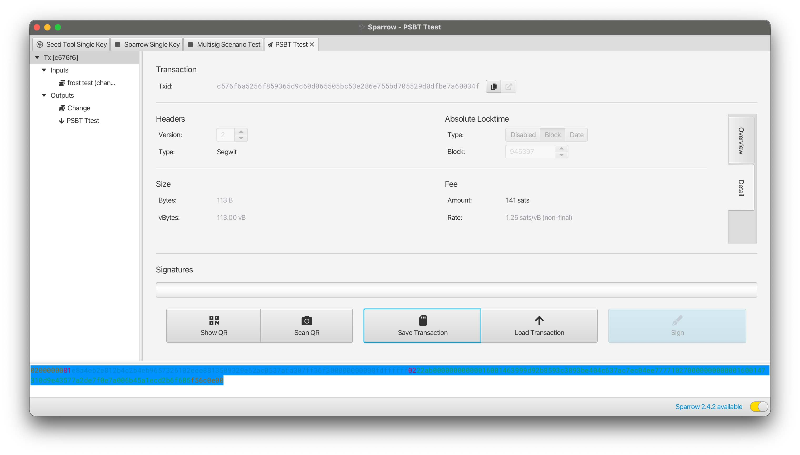
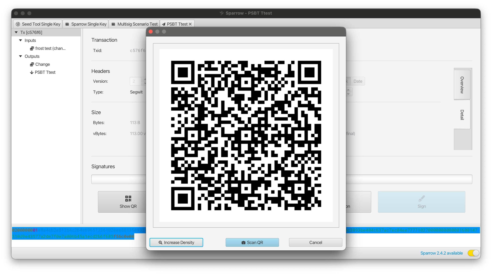
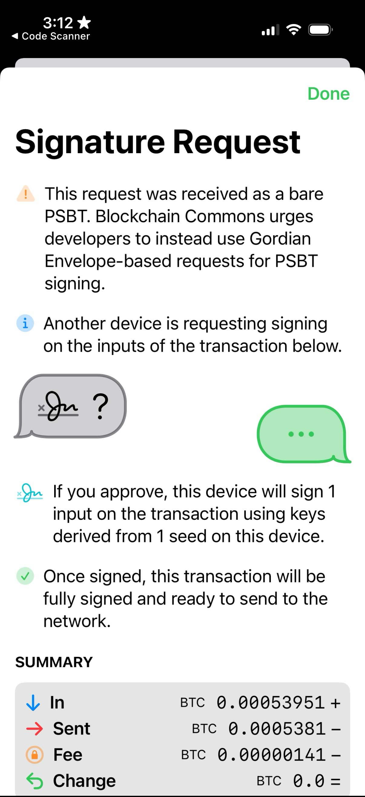
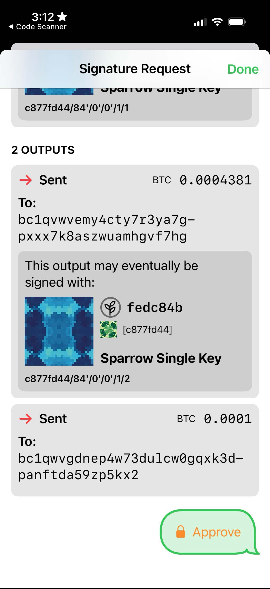

# 8.4: Creating Animated QR Codes

As discussed in [§4.3: Creating QR Codes for Addresses](04_3_Creating_QR_Codes_for_Addresses.md), QR codes are a great method for transmitting data across airgaps. They're also great for ensuring that there are no mistakes in your transmission. Unfortunately, QR codes are limited to 2953 bytes of binary data. That's sufficient for an address or a seed, but it's not big enough for a PSBT.

Animated QRs which use multiple frames to depict data, are the answer.

## The Power of Uniform Resources

Blockchain Commons solved the problem of animated QRs with [Uniform Resources, or URs](https://developer.blockchaincommons.com/ur/), which are a methodology for encoding data as plain-text strings that are also well-formed URIs. 

The specifics of encoding URs are overviewed on [Blockchain Commons' UR page](https://developer.blockchaincommons.com/ur/#how-do-urs-work) and fully specific in [BCR-2020-005](https://github.com/BlockchainCommons/Research/blob/master/papers/bcr-2020-005-ur.md). In short, you:

1. Encode your data as CBOR.
2. Convert the CBOR to minimal-format [Bytewords](https://developer.blockchaincommons.com/bytewords/).
3. Prefix the Bytewords with `ur:type`.

There are [libraries](https://developer.blockchaincommons.com/ur/#libraries) that take care of all of this for you, as well a [command-line program](https://github.com/BlockchainCommons/bytewords-cli) that can be used to generate minimal Bytewords format from CBOR.

The magic sauce in URs is the ability to sequence, creating [multi-part URs](https://github.com/BlockchainCommons/Research/blob/master/papers/bcr-2024-001-multipart-ur.md).

This is what allows the creation of Animated QRs: data is converted to UR format and sequenced, then each individually sequenced UR is used as the foundation of a single frame of the Animated QR.

## Create an Animated QR

Blockchain Commons doesn't currently have a command-line tool for creating Animated QRs.

Our [URKit](https://github.com/BlockchainCommons/URDemo) does demo the conversion of messages to animated QRs as a full MacOS app. Similarly, [Gordian Seed Tool](https://apps.apple.com/us/app/gordian-seed-tool/id1545088229) will display animated QRs for some elements.

However, the easiest method to testbed the creation of animated QRs currently is the [BC-UR playground](https://irfan798.github.io/bcur.me/#multi-ur).

### Create an Animated PSBT

Converting from a PSBT to an Animated QR of that PSBT is a four step process.

We're going to use the following PSBT as an example, which is the one from [§8.1](08_1_Spending_a_Multisig_with_a_PSBT.md#sign-the-psbt).
```
psbt="cHNidP8BAHECAAAAAT4TNngXer/516PCopCaldswA84O2DuOrjI96CnYtkHrAQAAAAD9////AoyGAQAAAAAAFgAUDxr9tZEk6HuEqwJratxEZgdYqHmMhgEAAAAAABYAFKcU+Pe6En0kSNY4w+nQR4mTJ2XNAAAAAAABAIkCAAAAAWtqWUkvCC+bIQ0Y+RNM5sSiS4oPa9ILa4SV3YUMff7SbQEAAAD9////AteWBAAAAAAAIlEg35Pids1jTkfrgrzTG8LpPlzkPzi76pCjdVURwfnSLIhADQMAAAAAACIAID4RoDr3ZQ4gvfR2gTCkx0a0/XXWltNCC/bn0PhgobmPAAAAAAEBK0ANAwAAAAAAIgAgPhGgOvdlDiC99HaBMKTHRrT9ddaW00IL9ufQ+GChuY8BBUdSIQOTlfoZ1lEvAwQyEM0+mgOoUPeo2YbI810w8u/CgajTMSEDxX7XB3XXphZ3hRTnOP7wlGtL5O4yRAsZ9l3dbjRZg8BSriIGA5OV+hnWUS8DBDIQzT6aA6hQ96jZhsjzXTDy78KBqNMxBDgQGUciBgPFftcHddemFneFFOc4/vCUa0vk7jJECxn2Xd1uNFmDwAQDlP6zAAAA"
```

**Step 1:** Convert the PSBT from Base64 (that's the standard PSBT format that always starts with `cH` and ends with `AAAA`) to hex.

This can usually be done from a command line using the `base64` and `xxd` tools:
```
$ psbt_hex=$(echo $psbt | base64 -d | xxd -p -c 0)
$ echo $psbt_hex
70736274ff01007102000000013e133678177abff9d7a3c2a2909a95db3003ce0ed83b8eae323de829d8b641eb0100000000fdffffff028c860100000000001600140f1afdb59124e87b84ab026b6adc44660758a8798c86010000000000160014a714f8f7ba127d2448d638c3e9d04789932765cd000000000001008902000000016b6a59492f082f9b210d18f9134ce6c4a24b8a0f6bd20b6b8495dd850c7dfed26d01000000fdffffff02d796040000000000225120df93e276cd634e47eb82bcd31bc2e93e5ce43f38bbea90a3755511c1f9d22c88400d0300000000002200203e11a03af7650e20bdf4768130a4c746b4fd75d696d3420bf6e7d0f860a1b98f0000000001012b400d0300000000002200203e11a03af7650e20bdf4768130a4c746b4fd75d696d3420bf6e7d0f860a1b98f0105475221039395fa19d6512f03043210cd3e9a03a850f7a8d986c8f35d30f2efc281a8d3312103c57ed70775d7a616778514e738fef0946b4be4ee32440b19f65ddd6e345983c052ae2206039395fa19d6512f03043210cd3e9a03a850f7a8d986c8f35d30f2efc281a8d3310438101947220603c57ed70775d7a616778514e738fef0946b4be4ee32440b19f65ddd6e345983c0040394feb3000000
```

If you prefer (or if you don't have these tools on your machine), [Learn Me a Bitcoin](https://learnmeabitcoin.com/technical/transaction/psbt/) has a nice tool specifically for converting PSBTs between Base64 and Hex.

**Step 2:** Prepare the PSBT for CBOR encoding.

There are specifications for how to convert any data into UR encoding using CBOR, all found in the [UR registry](https://github.com/BlockchainCommons/Research/blob/master/papers/bcr-2020-006-urtypes.md). The [PSBT CDDL](https://github.com/BlockchainCommons/Research/blob/master/papers/bcr-2020-006-urtypes.md#partially-signed-bitcoin-transaction-psbt-psbt) says that we just represent it as a bare hexadecimal.

In CBOR diagnostic notation that's:
```
h'hexcode'
```
So:
```
$ psbt_cbor_notation="h'$psbt_hex'"
$ echo $psbt_cbor_notation
h'70736274ff01007102000000013e133678177abff9d7a3c2a2909a95db3003ce0ed83b8eae323de829d8b641eb0100000000fdffffff028c860100000000001600140f1afdb59124e87b84ab026b6adc44660758a8798c86010000000000160014a714f8f7ba127d2448d638c3e9d04789932765cd000000000001008902000000016b6a59492f082f9b210d18f9134ce6c4a24b8a0f6bd20b6b8495dd850c7dfed26d01000000fdffffff02d796040000000000225120df93e276cd634e47eb82bcd31bc2e93e5ce43f38bbea90a3755511c1f9d22c88400d0300000000002200203e11a03af7650e20bdf4768130a4c746b4fd75d696d3420bf6e7d0f860a1b98f0000000001012b400d0300000000002200203e11a03af7650e20bdf4768130a4c746b4fd75d696d3420bf6e7d0f860a1b98f0105475221039395fa19d6512f03043210cd3e9a03a850f7a8d986c8f35d30f2efc281a8d3312103c57ed70775d7a616778514e738fef0946b4be4ee32440b19f65ddd6e345983c052ae2206039395fa19d6512f03043210cd3e9a03a850f7a8d986c8f35d30f2efc281a8d3310438101947220603c57ed70775d7a616778514e738fef0946b4be4ee32440b19f65ddd6e345983c0040394feb3000000'
```

**Step 3:** Convert the PSBT to CBOR.

You now need to convert your CBOR diagnostic notation to CBOR (and you might have skipped right to this, because it's really easy to do for a bare hexadecimal number). If you have Ruby installed, you can do this with the [CBOR diagonistic utilities](https://github.com/cabo/cbor-diag).
```
$ psbt_cbor=$(echo $psbt_cbor_notation | diag2cbor.rb | xxd -p -c0)
$ echo $psbt_cbor
5901d170736274ff01007102000000013e133678177abff9d7a3c2a2909a95db3003ce0ed83b8eae323de829d8b641eb0100000000fdffffff028c860100000000001600140f1afdb59124e87b84ab026b6adc44660758a8798c86010000000000160014a714f8f7ba127d2448d638c3e9d04789932765cd000000000001008902000000016b6a59492f082f9b210d18f9134ce6c4a24b8a0f6bd20b6b8495dd850c7dfed26d01000000fdffffff02d796040000000000225120df93e276cd634e47eb82bcd31bc2e93e5ce43f38bbea90a3755511c1f9d22c88400d0300000000002200203e11a03af7650e20bdf4768130a4c746b4fd75d696d3420bf6e7d0f860a1b98f0000000001012b400d0300000000002200203e11a03af7650e20bdf4768130a4c746b4fd75d696d3420bf6e7d0f860a1b98f0105475221039395fa19d6512f03043210cd3e9a03a850f7a8d986c8f35d30f2efc281a8d3312103c57ed70775d7a616778514e738fef0946b4be4ee32440b19f65ddd6e345983c052ae2206039395fa19d6512f03043210cd3e9a03a850f7a8d986c8f35d30f2efc281a8d3310438101947220603c57ed70775d7a616778514e738fef0946b4be4ee32440b19f65ddd6e345983c0040394feb3000000
```
You might note that all that happened is that a `5901d1` got prepended to the hex, which is the length of the PSBT.

If you prefer (or didn't want to install Ruby on your machine), you can go to [cbor.me](https://cbor.me/), which will convert CBOR diagnostic notation (left) to CBOR (right).

**Step 4:** Convert the CBOR PSBT to a UR

Encoding the CBOR as a UR now requires converting the CBOR to [minimal bytewords](https://developer.blockchaincommons.com/bytewords/) and adding the prefix 'ur:psbt/'

Blockchain Commons has a [`bytewords-cli`](https://github.com/BlockchainCommons/bytewords-cli) that will do the trick:
```
$ psbt_bw=$(bytewords -i hex -o minimal $psbt_cbor)
$ echo $psbt_bw
hkadttjojkidjyzmadaejsaoaeaeaeadfmbwenkschknrsyttsotsaoemhnymduydyaxtobatpfrmnpleyfsvsdttprpfpwmadaeaeaeaezczmzmzmaolklnadaeaeaeaeaecmaebbbscyzcremedkvskglrpyaojeimuofyiyathdpdkklklnadaeaeaeaeaecmaebbosbbyaylrdbgkidkfdtbetsrwltiflldmudiihsnaeaeaeaeaeadaeldaoaeaeaeadjeimhkgadlaydlndclbtcsytbwgsvassoegrlebsjetdbdjelrmdutlpbnkizetdjnadaeaeaezczmzmzmaotsmtaaaeaeaeaeaecpgycxurmuvokosniaglflwmlfrftecwsawlfmhhvefhetrkwdmhotkpgobyseyttddwlofzbtaxaeaeaeaeaecpaecxfmbynbftylihbacxrywkkolydyoxstfgqzzckptbmttefwbdynvdtiyahnoyrhmyaeaeaeaeadaddnfzbtaxaeaeaeaeaecpaecxfmbynbftylihbacxrywkkolydyoxstfgqzzckptbmttefwbdynvdtiyahnoyrhmyadahflgmclaxmumdzscftbgydlaxaaeybesnfmnyaxpdgdylpdtalnspwfhldywzwssalypdteehclaxskkbtsatkptsolcmktlpbbvdetzewtmwjegrvewyeyfybdcfynhlutjteehklsrtgmplcpamaxmumdzscftbgydlaxaaeybesnfmnyaxpdgdylpdtalnspwfhldywzwssalypdteehaaetbecfflcpamaxskkbtsatkptsolcmktlpbbvdetzewtmwjegrvewyeyfybdcfynhlutjteehklsrtaaaxmwzeqdaeaeaelsdastje
```
You then just add the prefix by hand:
```
$ psbt_ur="ur:psbt/$psbt_bw"
$ echo $psbt_ur
ur:psbt/hkadttjojkidjyzmadaejsaoaeaeaeadfmbwenkschknrsyttsotsaoemhnymduydyaxtobatpfrmnpleyfsvsdttprpfpwmadaeaeaeaezczmzmzmaolklnadaeaeaeaeaecmaebbbscyzcremedkvskglrpyaojeimuofyiyathdpdkklklnadaeaeaeaeaecmaebbosbbyaylrdbgkidkfdtbetsrwltiflldmudiihsnaeaeaeaeaeadaeldaoaeaeaeadjeimhkgadlaydlndclbtcsytbwgsvassoegrlebsjetdbdjelrmdutlpbnkizetdjnadaeaeaezczmzmzmaotsmtaaaeaeaeaeaecpgycxurmuvokosniaglflwmlfrftecwsawlfmhhvefhetrkwdmhotkpgobyseyttddwlofzbtaxaeaeaeaeaecpaecxfmbynbftylihbacxrywkkolydyoxstfgqzzckptbmttefwbdynvdtiyahnoyrhmyaeaeaeaeadaddnfzbtaxaeaeaeaeaecpaecxfmbynbftylihbacxrywkkolydyoxstfgqzzckptbmttefwbdynvdtiyahnoyrhmyadahflgmclaxmumdzscftbgydlaxaaeybesnfmnyaxpdgdylpdtalnspwfhldywzwssalypdteehclaxskkbtsatkptsolcmktlpbbvdetzewtmwjegrvewyeyfybdcfynhlutjteehklsrtgmplcpamaxmumdzscftbgydlaxaaeybesnfmnyaxpdgdylpdtalnspwfhldywzwssalypdteehaaetbecfflcpamaxskkbtsatkptsolcmktlpbbvdetzewtmwjegrvewyeyfybdcfynhlutjteehklsrtaaaxmwzeqdaeaeaelsdastje
```
As usual, there's an online alternative. You go to the [BC-UR converter](https://irfan798.github.io/bcur.me/#converter) and choose "Hex (CBOR)" as the input and "Single UR" as the output, then paste your hex into the big input box. You'll also need to flag the output as "psbt" as it will start out "unknown".

**Step 5: Create an Animated QR**

The final step of creating the Animated QR from the UR is only available online at the [BC-UR Multi-UR and QR Generator](https://irfan798.github.io/bcur.me/#multi-ur).

If you used the BC-UR converter to create your UR, just click the "Send to Multi-UR" button.

If you did everything to this point on the command line, go to the [BC-UR Multi-UR and QR Generator](https://irfan798.github.io/bcur.me/#multi-ur) and paste your `$psbt_ur` into the input box

Afterward, scroll down and click "Generate Multi-UR and QR". You'll see the UR sequences show up to the top right and the Animated QR to the bottom. 

If you now were to read that Animated QR into a wallet that understands animated QRs, it would hopefully pop up a screen either asking you to sign the PSBT, or telling you that it doesn't have the right key for signing. [Gordian Seed Tool](https://apps.apple.com/us/app/gordian-seed-tool/id1545088229) is a reference app that includes signing, but there are many more, as Animated QRs have come into wide use.

**Review the Steps**

It probably seemed like a lot of work to convert into Animated QRs. That's only because we had to string together either several command line applications or several different websites. Programmatically the process is simple:

1. Convert the PSBT from Base64 to Hex.
2. Encode the PSBT as bare hex in CBOR.
3. Convert the CBOR into a UR.
4. Fragment the UR as desired, and use each fragment to generate a GIF frame.

## Sign with an Animated QR

Bitcoin Core doesn't know anything about Animated QRs, which makes sense as it's a command-line program. But they're in wide use in the larger Bitcoin ecosystems so that seeds and keys can be held on better protected mobile devices, where they sign PSBTs encoded in Animated QRs to spend funds.

The following shows the process, using [Sparrow Wallet](https://sparrowwallet.com/) as a coordinator and [Gordian Seed Tool]((https://apps.apple.com/us/app/gordian-seed-tool/id1545088229)) as a seed vault.

**Step 1: [Coordinator] Create the PSBT:**



**Step 2: [Coordinator] Generate the Animated QR:**



(only one frame is shown here)

**Step 3: [Seed Vault] Read the Animated QR:**

<center>
  
</center>

**Step 4: [Seed Vault] Review the PSBT:**



**Step 5: [Seed Vault] Approve the PSBT:**



## Summary: Creating Animated QR Codes

As with the QRs of [§4.3](04_3_Creating_QR_Codes_for_Addresses.md), you won't make any more use of Animated QRs in this course, because the command line fundamentally isn't a graphical environment.

And as with the QRs of §4.3, the Animated QRs discussed here will have wide applicability when you move into the larger Bitcoin world. They are a vital tool for bridging airgaps, because QRs can't store large PSBTs.

> :fire: ***What's the power of a Animated QRs?*** Animated QRs allow you to transfer larger amounts of information, such as a PSBT, across an airgap. This allows you to store seeds and keys used for signing Bitcoin transactions on a device not directly connected to the internet, making them safer and less prone to compromise. The use of Animated QRs to pass PSBTs back and forth ensures that the whole process remains easy to use.

## What's Next?

Consluding "Expanding Bitcoin Transactions with PSBTs" with our fourth real-world use case, [§8.5: Integrating with Hardware Wallets](08_5_Integrating_with_Hardware_Wallets.md).
