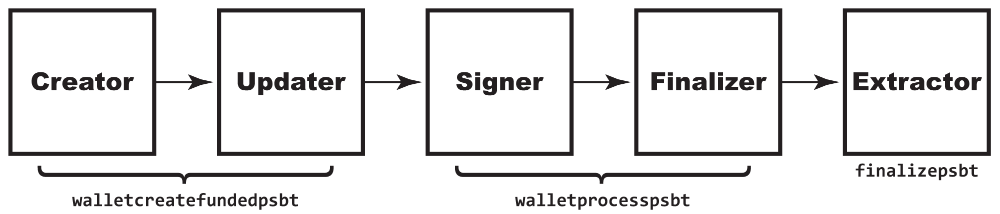

# 7.1: Creando una Transacción Bitcoin Parcialmente Firmada

> :information_source: **NOTA:** Esta sección se ha agregado recientemente al curso y es un borrador inicial que aún puede estar pendiente de revisión. Lectura con precaución.

Las transacciones de Bitcoin parcialmente firmadas (PSBT) son la forma más nueva de variar la creación de transacciones básicas de Bitcoin. Para ello, introducen la colaboración en cada paso del proceso, lo que permite a las personas (o programas) no solo autenticar las transacciones juntas (como con las multifirmas), sino también crear, financiar y transmitir fácilmente de manera colaborativa.

> :warning: **ADVERTENCIA DE VERSIÓN:** Esta es una innovación de Bitcoin Core v 0.17.0. Las versiones anteriores de Bitcoin Core no podrán funcionar con el PSBT mientras esté en progreso (aunque aún podrán reconocer la transacción final). Algunas actualizaciones y mejoras para PSBT han continuado hasta 0.20.0.

## Comprenda cómo funcionan los PSBT

Las multifirmas fueron excelentes para el caso muy específico de la tenencia conjunta de fondos y el establecimiento de reglas para quién, entre los firmantes conjuntos, podría autenticar el uso de esos fondos. Hay muchos casos de uso, como: una cuenta bancaria conjunta del cónyuge (una firma de 1 de 2); un requisito fiduciario para el control dual (una firma 2 de 2); y un depósito en garantía (una firma 2 de 3). 

> :book: ***Que es una PSBT?*** Como sugiere el nombre, un PSBT es una transacción que no se ha firmado por completo. Eso es importante, porque una vez que se firma una transacción, su contenido se bloquea. [BIP174](https://github.com/bitcoin/bips/blob/master/bip-0174.mediawiki) definió una metodología abstracta para poner los PSBTs juntos que describe y estandariza los roles en su creación colaborativa. Un *Creador* propone una transacción; uno o más *Actualizadores* lo complementan; y uno o más *Firmantes* lo autentican; antes de que un *Finalizador* lo complete; y un *Extracter* lo convierte en una transacción para la red Bitcoin. También puede haber un *Combinador* que fusiona PSBT paralelos de diferentes usuarios. 

Inicialmente, los PSBT pueden tener un aspecto similar a las multifirmas porque tienen un solo bit de funcionalidad superpuesto: la capacidad de firmar conjuntamente una transacción. Sin embargo, fueron creados para un caso de uso totalmente diferente. Los PSBT reconocen la necesidad de que varios programas creen conjuntamente una transacción por varias razones diferentes, y proporcionan un formato regularizado para hacerlo. Son especialmente útiles para casos de uso que involucran billeteras de hardware (para lo cual, consulte [§7.3](https://github.com/BlockchainCommons/Learning-Bitcoin-from-the-Command-Line/blob/master/07_3_Integrating_with_Hardware_Wallets.md)), que están protegidas del acceso total a Internet y tienden a tener un historial de transacciones mínimo.

En general, los PSBT proporcionan una serie de elementos funcionales que mejoran este caso de uso:

1. Proporcionan un _estándar_ para la creación colaborativa de transacciones, mientras que las metodologías anteriores (incluida la multifirma del capítulo anterior) dependían de la implementación.
2. Admiten una _variedad más amplia de casos de uso_, incluida la financiación conjunta simple.
3. Admiten _billeteras de hardware_ y otros casos en los que un nodo puede no tener un historial de transacciones completo.
4. Opcionalmente, permiten la combinación de _transacciones no serializadas_, sin requerir que se pase un código hexadecimal cada vez más grande de usuario a usuario.

Los PSBT hacen su trabajo al complementar la información de las transacciones normales con un conjunto de entradas y salidas, cada una de las cuales define todo lo que necesita saber sobre esos UTXO, de modo que incluso una una billetera aislada pueda tomar una decisión informada sobre las firmas. Por lo tanto, una entrada enumera la cantidad de dinero en un UTXO y lo que se debe hacer para gastarlo, mientras que una salida hace lo mismo para los UTXO que está creando.

Esta primera sección describirá el proceso estándar de PSBT de: Creador, Actualizador, Firmante, Finalizador, Extractor. Lo hará desde una sola máquina, lo que hará que parezca una forma complicada de crear una transacción sin procesar. Pero, ten fe, ¡esto tiene un propósito! [§7.2](07_2_Usando_una_Transaccion_Bitcoin_Parcialmente_Firmada.md) y [§7.3](07_3_Integrando_con_Hardware_Wallets.md) mostrará algunos ejemplos de la vida real del uso de PSBT y convertirá este simple sistema en un proceso colaborativo compartido entre múltiples máquinas que tiene efectos reales y crea oportunidades reales.

## Cree un PSBT a la antigua
#### Rol en la PSBT: Creador

La forma más fácil de crear un PSBT es tomar una transacción existente y usar `converttopsbt` para convertirla en un PSBT. Ciertamente, esta no es la mejor manera, ya que requiere que realice una transacción para un formato (una transacción sin procesar) y luego la convierta a otro (PSBT), pero si tiene un software antiguo que solo puede generar una transacción sin procesar, puede que necesite usarlo..

Solo crea su transacción sin procesar normalmente:

```
$ utxo_txid_1=$(bitcoin-cli listunspent | jq -r '.[0] | .txid')
$ utxo_vout_1=$(bitcoin-cli listunspent | jq -r '.[0] | .vout')
$ utxo_txid_2=$(bitcoin-cli listunspent | jq -r '.[1] | .txid')
$ utxo_vout_2=$(bitcoin-cli listunspent | jq -r '.[1] | .vout')
$ echo $utxo_txid_1 $utxo_vout_1 $utxo_txid_2 $utxo_vout_2
c6de60427b28d8ec8102e49771e5d0348fc3ef6a5bf02eb864ec745105a6951b 1 8748eff5f12ca886e3603d9e30227dcb3f0332e0706c4322fec96001f7c7f41c 0
$ recipient=tb1qcaedd724gts3aug73m78c7nfsv9d8zs9q6h2kd
$ rawtxhex=$(bitcoin-cli -named createrawtransaction inputs='''[ { "txid": "'$utxo_txid_1'", "vout": '$utxo_vout_1' }, { "txid": "'$utxo_txid_2'", "vout": '$utxo_vout_2' } ]''' outputs='''{ "'$recipient'": 0.0000065 }''')
```
Entonces conviértalo:
```
$ psbt=$(bitcoin-cli -named converttopsbt hexstring=$rawtxhex)
$ echo $psbt
cHNidP8BAHsCAAAAAhuVpgVRdOxkuC7wW2rvw4800OVxl+QCgezYKHtCYN7GAQAAAAD/////HPTH9wFgyf4iQ2xw4DIDP8t9IjCePWDjhqgs8fXvSIcAAAAAAP////8BigIAAAAAAAAWABTHctb5VULhHvEejvx8emmDCtOKBQAAAAAAAAAA
```
Tenga en cuenta que la codificación PSBT se ve muy diferente de la transacción hexadecimal.

Pero si puede, desea crear el PSBT directamente en su lugar...

## Cree un PSBT de la manera difícil
#### Rol en la PSBT: Creador

La primera metodología para crear un PSBT sin pasar por otro formato es el equivalente en PSBT de `createrawtransaction`. Se llama `createpsbt` y le brinda el máximo control al costo de la máxima labor y la máxima oportunidad de error.

La CLI debería parecer bastante familiar, solo con un nuevo comando RPC:
```
$ psbt_1=$(bitcoin-cli -named createpsbt inputs='''[ { "txid": "'$utxo_txid_1'", "vout": '$utxo_vout_1' }, { "txid": "'$utxo_txid_2'", "vout": '$utxo_vout_2' } ]''' outputs='''{ "'$recipient'": 0.0000065 }''')
```
El equipo de Bitcoin Core se aseguró de que `createpsbt` funcionara de manera muy similar a` createrawtransaction`, por lo que no es necesario que aprenda un formato de creación diferente.

Puede verificar que el nuevo PSBT es el mismo que el creado por `converttopsbt`:
```
$ echo $psbt_1
cHNidP8BAHsCAAAAAhuVpgVRdOxkuC7wW2rvw4800OVxl+QCgezYKHtCYN7GAQAAAAD/////HPTH9wFgyf4iQ2xw4DIDP8t9IjCePWDjhqgs8fXvSIcAAAAAAP////8BigIAAAAAAAAWABTHctb5VULhHvEejvx8emmDCtOKBQAAAAAAAAAA
$ if [ "$psbt" == "$psbt_1" ]; then     echo "PSBTs are equal"; else     echo "PSBTs are not equal"; fi
PSBTs are equal
```

## Examine una PSBT
#### Rol en la PSBT: Cualquiera

Entonces, ¿cómo se ve realmente tu PSBT? Puede ver eso con el comando `decodepsbt`:
```
$ bitcoin-cli -named decodepsbt psbt=$psbt
{
  "tx": {
    "txid": "ea73a631b456d2b041ed73bf5767946408c6ff067716929a68ecda2e3e4de6d3",
    "hash": "ea73a631b456d2b041ed73bf5767946408c6ff067716929a68ecda2e3e4de6d3",
    "version": 2,
    "size": 123,
    "vsize": 123,
    "weight": 492,
    "locktime": 0,
    "vin": [
      {
        "txid": "c6de60427b28d8ec8102e49771e5d0348fc3ef6a5bf02eb864ec745105a6951b",
        "vout": 1,
        "scriptSig": {
          "asm": "",
          "hex": ""
        },
        "sequence": 4294967295
      },
      {
        "txid": "8748eff5f12ca886e3603d9e30227dcb3f0332e0706c4322fec96001f7c7f41c",
        "vout": 0,
        "scriptSig": {
          "asm": "",
          "hex": ""
        },
        "sequence": 4294967295
      }
    ],
    "vout": [
      {
        "value": 0.00000650,
        "n": 0,
        "scriptPubKey": {
          "asm": "0 c772d6f95542e11ef11e8efc7c7a69830ad38a05",
          "hex": "0014c772d6f95542e11ef11e8efc7c7a69830ad38a05",
          "reqSigs": 1,
          "type": "witness_v0_keyhash",
          "addresses": [
            "tb1qcaedd724gts3aug73m78c7nfsv9d8zs9q6h2kd"
          ]
        }
      }
    ]
  },
  "unknown": {
  },
  "inputs": [
    {
    },
    {
    }
  ],
  "outputs": [
    {
    }
  ]
}
```
Es importante tener en cuenta que, aunque hemos definido los fundamentos de la transacción: los `vins` de dónde viene el dinero y los `vouts` de a dónde va, aún no hemos definido las `inputs` (entradas) y las `outputs` (salidas) que son el corazón de un PSBT y que son necesarias para los usuarios fuera de línea para evaluarlos. Esto es esperado: el rol del Creador como se define en [BIP174](https://github.com/bitcoin/bips/blob/master/bip-0174.mediawiki) es delinear la transacción, mientras que el rol del Actualizador es comenzar a llenar en los datos específicos de PSBT. (Otros comandos combinan los roles de Creador y Actualizador, pero `createpsbt` no lo hace porque no tiene acceso a su billetera).

También puede usar el comando `analysepsbt` para ver su estado actual:
```
standup@btctest20:~$ bitcoin-cli -named analyzepsbt psbt=$psbt
{
  "inputs": [
    {
      "has_utxo": false,
      "is_final": false,
      "next": "updater"
    },
    {
      "has_utxo": false,
      "is_final": false,
      "next": "updater"
    }
  ],
  "next": "updater"
}
```
Del mismo modo, `analysepsbt` nos muestra un PSBT que necesita mejorarse. Echamos un vistazo a cada una de las dos `inputs` (correspondientes a los dos `vins`), y ninguna tiene la información que necesita.

## Finalize una PSBT
#### Rol en la PSBT: Actualizador, Firmante, Finalizador

Existe un comando `utxoupdatepsbt` que se puede usar para actualizar UTXOs, importando su información de descriptor a mano, pero no desea usarlo a menos que tenga un caso de uso en el que no tenga toda esa información en las billeteras de todos los que firmarán el PSBT.

> :information_source: **NOTA:** Si elige Actualizar el PSBT con `utxoupdatepsbt`, aún necesitará usar `walletprocesspsbt` para firmarlo: es el único comando de rol de firmante para PSBT que está disponible en `bitcoin-cli`.

En su lugar, debe usar `walletprocesspsbt`, que actualizará, firmará y finalizará:
```
$ bitcoin-cli walletprocesspsbt $psbt
{
  "psbt": "cHNidP8BAHsCAAAAAhuVpgVRdOxkuC7wW2rvw4800OVxl+QCgezYKHtCYN7GAQAAAAD/////HPTH9wFgyf4iQ2xw4DIDP8t9IjCePWDjhqgs8fXvSIcAAAAAAP////8BigIAAAAAAAAWABTHctb5VULhHvEejvx8emmDCtOKBQAAAAAAAQEfAQAAAAAAAAAWABRsRdOvqHYghsS9dtinGsfJduGRlgEIawJHMEQCIAqJbxz6dBzNpfaDu4XZXb+DbDkM3UWnhezh9UdmeVghAiBRxMlW2o0wEtphtUZRWIiJOaGtXfsQbB4lovkvE4eRIgEhArrDpkX9egpTfGJ6039faVBYxY0ZzrADPpE/Gpl14A3uAAEBH0gDAAAAAAAAFgAU1ZEJG4B0ojde2ZhanEsY7+z9QWUBCGsCRzBEAiB+sNNCO4xiFQ+DoHVrqqk9yM0V4H9ZSyExx1PW7RbjsgIgUeWkQ3L7aAv1xIe7h+8PZb8ECsXg1UzbtPW8wd2qx0UBIQKIO7VGPjfVUlLYs9XCFBsAezfIp9tiEfdclVrMXqMl6wAA",
  "complete": true
}
```
Obviamente, necesitará guardar esa información de `psbt` usando` jq`:
```
$ psbt_f=$(bitcoin-cli walletprocesspsbt $psbt | jq -r '.psbt')
```
Puede ver que las `inputs` ahora se han completado:
```
$ bitcoin-cli decodepsbt $psbt_f
{
  "tx": {
    "txid": "ea73a631b456d2b041ed73bf5767946408c6ff067716929a68ecda2e3e4de6d3",
    "hash": "ea73a631b456d2b041ed73bf5767946408c6ff067716929a68ecda2e3e4de6d3",
    "version": 2,
    "size": 123,
    "vsize": 123,
    "weight": 492,
    "locktime": 0,
    "vin": [
      {
        "txid": "c6de60427b28d8ec8102e49771e5d0348fc3ef6a5bf02eb864ec745105a6951b",
        "vout": 1,
        "scriptSig": {
          "asm": "",
          "hex": ""
        },
        "sequence": 4294967295
      },
      {
        "txid": "8748eff5f12ca886e3603d9e30227dcb3f0332e0706c4322fec96001f7c7f41c",
        "vout": 0,
        "scriptSig": {
          "asm": "",
          "hex": ""
        },
        "sequence": 4294967295
      }
    ],
    "vout": [
      {
        "value": 0.00000650,
        "n": 0,
        "scriptPubKey": {
          "asm": "0 c772d6f95542e11ef11e8efc7c7a69830ad38a05",
          "hex": "0014c772d6f95542e11ef11e8efc7c7a69830ad38a05",
          "reqSigs": 1,
          "type": "witness_v0_keyhash",
          "addresses": [
            "tb1qcaedd724gts3aug73m78c7nfsv9d8zs9q6h2kd"
          ]
        }
      }
    ]
  },
  "unknown": {
  },
  "inputs": [
    {
      "witness_utxo": {
        "amount": 0.00000001,
        "scriptPubKey": {
          "asm": "0 6c45d3afa8762086c4bd76d8a71ac7c976e19196",
          "hex": "00146c45d3afa8762086c4bd76d8a71ac7c976e19196",
          "type": "witness_v0_keyhash",
          "address": "tb1qd3za8tagwcsgd39awmv2wxk8e9mwryvktqmkkg"
        }
      },
      "final_scriptwitness": [
        "304402200a896f1cfa741ccda5f683bb85d95dbf836c390cdd45a785ece1f54766795821022051c4c956da8d3012da61b5465158888939a1ad5dfb106c1e25a2f92f1387912201",
        "02bac3a645fd7a0a537c627ad37f5f695058c58d19ceb0033e913f1a9975e00dee"
      ]
    },
    {
      "witness_utxo": {
        "amount": 0.00000840,
        "scriptPubKey": {
          "asm": "0 d591091b8074a2375ed9985a9c4b18efecfd4165",
          "hex": "0014d591091b8074a2375ed9985a9c4b18efecfd4165",
          "type": "witness_v0_keyhash",
          "address": "tb1q6kgsjxuqwj3rwhkenpdfcjccalk06st9z0k0kh"
        }
      },
      "final_scriptwitness": [
        "304402207eb0d3423b8c62150f83a0756baaa93dc8cd15e07f594b2131c753d6ed16e3b2022051e5a44372fb680bf5c487bb87ef0f65bf040ac5e0d54cdbb4f5bcc1ddaac74501",
        "02883bb5463e37d55252d8b3d5c2141b007b37c8a7db6211f75c955acc5ea325eb"
      ]
    }
  ],
  "outputs": [
    {
    }
  ],
  "fee": 0.00000191
}
```
O para ser más precisos: (1) el PSBT se ha actualizado con la información de `witness_utxo`; (2) se ha firmado el PSBT; y (3) se ha finalizado el PSBT.


## Cree un PSBT de la manera más fácil
#### Rol en la PSBT: Creador, Actualizador

Si cree que debería haber un comando equivalente a `fundrawtransaction`, le complacerá saber que existe: `walletcreatefundedpsbt`. Podría usarlo de la misma manera que `createpsbt`:
```
$ bitcoin-cli -named walletcreatefundedpsbt inputs='''[ { "txid": "'$utxo_txid_1'", "vout": '$utxo_vout_1' }, { "txid": "'$utxo_txid_2'", "vout": '$utxo_vout_2' } ]''' outputs='''{ "'$recipient'": 0.0000065 }'''
{
  "psbt": "cHNidP8BAOwCAAAABBuVpgVRdOxkuC7wW2rvw4800OVxl+QCgezYKHtCYN7GAQAAAAD/////HPTH9wFgyf4iQ2xw4DIDP8t9IjCePWDjhqgs8fXvSIcAAAAAAP/////uFwerANKjyVK6WaR7gzlX+lOf+ORsfjP5LYCSNIbhaAAAAAAA/v///4XjOeey0NyGpJYpszNWF8AFNiuFaWsjkOrk35Jp+9kKAAAAAAD+////AtYjEAAAAAAAFgAUMPsier2ey1eH48oGqrbbYGzNHgKKAgAAAAAAABYAFMdy1vlVQuEe8R6O/Hx6aYMK04oFAAAAAAABAR8BAAAAAAAAABYAFGxF06+odiCGxL122Kcax8l24ZGWIgYCusOmRf16ClN8YnrTf19pUFjFjRnOsAM+kT8amXXgDe4Q1gQ4AAAAAIABAACADgAAgAABAR9IAwAAAAAAABYAFNWRCRuAdKI3XtmYWpxLGO/s/UFlIgYCiDu1Rj431VJS2LPVwhQbAHs3yKfbYhH3XJVazF6jJesQ1gQ4AAAAAIABAACADAAAgAABAIwCAAAAAdVmsvkSBmfeHqNAe/wDCQ5lEp9F/587ftzCD1UL60nMAQAAABcWABRzFxRJfFPl8FJ6SxjAJzy3mCAMXf7///8CQEIPAAAAAAAZdqkUf0NzebzGbEB0XtwYkeprODDhl12IrMEwLQAAAAAAF6kU/d+kMX6XijmD+jWdUrLZlJUnH2iHPhQbACIGA+/e40wACf0XXzsgteWlUX/V0WdG8uY1tEYXra/q68OIENYEOAAAAACAAAAAgBIAAIAAAQEfE4YBAAAAAAAWABTVkQkbgHSiN17ZmFqcSxjv7P1BZSIGAog7tUY+N9VSUtiz1cIUGwB7N8in22IR91yVWsxeoyXrENYEOAAAAACAAQAAgAwAAIAAIgICKMavAB+71Adqsbf+XtC1g/OlmLEuTp3U0axyeu/LAI0Q1gQ4AAAAAIABAACAGgAAgAAA",
  "fee": 0.00042300,
  "changepos": 0
}
```
Sin embargo, la gran ventaja es que puede usarlo para autofinanciarse omitiendo las `inputs`, al igual que `fundrawtransaction`. 
```
$ psbt_new=$(bitcoin-cli -named walletcreatefundedpsbt inputs='''[]''' outputs='''{ "'$recipient'": 0.0000065 }''' | jq -r '.psbt')
$ bitcoin-cli decodepsbt $psbt_new
{
  "tx": {
    "txid": "9f2c6205ac797c1020f7f261e3ab71cd0699ff4b1a8934f68b273c71547e235f",
    "hash": "9f2c6205ac797c1020f7f261e3ab71cd0699ff4b1a8934f68b273c71547e235f",
    "version": 2,
    "size": 154,
    "vsize": 154,
    "weight": 616,
    "locktime": 0,
    "vin": [
      {
        "txid": "8748eff5f12ca886e3603d9e30227dcb3f0332e0706c4322fec96001f7c7f41c",
        "vout": 0,
        "scriptSig": {
          "asm": "",
          "hex": ""
        },
        "sequence": 4294967294
      },
      {
        "txid": "68e1863492802df9337e6ce4f89f53fa5739837ba459ba52c9a3d200ab0717ee",
        "vout": 0,
        "scriptSig": {
          "asm": "",
          "hex": ""
        },
        "sequence": 4294967294
      }
    ],
    "vout": [
      {
        "value": 0.00971390,
        "n": 0,
        "scriptPubKey": {
          "asm": "0 09a74ef0bae4d68b0b2ec9a7c4557a2b5c85bd8b",
          "hex": "001409a74ef0bae4d68b0b2ec9a7c4557a2b5c85bd8b",
          "reqSigs": 1,
          "type": "witness_v0_keyhash",
          "addresses": [
            "tb1qpxn5au96untgkzewexnug4t69dwgt0vtfahcv6"
          ]
        }
      },
      {
        "value": 0.00000650,
        "n": 1,
        "scriptPubKey": {
          "asm": "0 c772d6f95542e11ef11e8efc7c7a69830ad38a05",
          "hex": "0014c772d6f95542e11ef11e8efc7c7a69830ad38a05",
          "reqSigs": 1,
          "type": "witness_v0_keyhash",
          "addresses": [
            "tb1qcaedd724gts3aug73m78c7nfsv9d8zs9q6h2kd"
          ]
        }
      }
    ]
  },
  "unknown": {
  },
  "inputs": [
    {
      "witness_utxo": {
        "amount": 0.00000840,
        "scriptPubKey": {
          "asm": "0 d591091b8074a2375ed9985a9c4b18efecfd4165",
          "hex": "0014d591091b8074a2375ed9985a9c4b18efecfd4165",
          "type": "witness_v0_keyhash",
          "address": "tb1q6kgsjxuqwj3rwhkenpdfcjccalk06st9z0k0kh"
        }
      },
      "bip32_derivs": [
        {
          "pubkey": "02883bb5463e37d55252d8b3d5c2141b007b37c8a7db6211f75c955acc5ea325eb",
          "master_fingerprint": "d6043800",
          "path": "m/0'/1'/12'"
        }
      ]
    },
    {
      "non_witness_utxo": {
        "txid": "68e1863492802df9337e6ce4f89f53fa5739837ba459ba52c9a3d200ab0717ee",
        "hash": "68e1863492802df9337e6ce4f89f53fa5739837ba459ba52c9a3d200ab0717ee",
        "version": 2,
        "size": 140,
        "vsize": 140,
        "weight": 560,
        "locktime": 1774654,
        "vin": [
          {
            "txid": "cc49eb0b550fc2dc7e3b9fff459f12650e0903fc7b40a31ede670612f9b266d5",
            "vout": 1,
            "scriptSig": {
              "asm": "0014731714497c53e5f0527a4b18c0273cb798200c5d",
              "hex": "160014731714497c53e5f0527a4b18c0273cb798200c5d"
            },
            "sequence": 4294967294
          }
        ],
        "vout": [
          {
            "value": 0.01000000,
            "n": 0,
            "scriptPubKey": {
              "asm": "OP_DUP OP_HASH160 7f437379bcc66c40745edc1891ea6b3830e1975d OP_EQUALVERIFY OP_CHECKSIG",
              "hex": "76a9147f437379bcc66c40745edc1891ea6b3830e1975d88ac",
              "reqSigs": 1,
              "type": "pubkeyhash",
              "addresses": [
                "ms7ruzvL4atCu77n47dStMb3of6iScS8kZ"
              ]
            }
          },
          {
            "value": 0.02961601,
            "n": 1,
            "scriptPubKey": {
              "asm": "OP_HASH160 fddfa4317e978a3983fa359d52b2d99495271f68 OP_EQUAL",
              "hex": "a914fddfa4317e978a3983fa359d52b2d99495271f6887",
              "reqSigs": 1,
              "type": "scripthash",
              "addresses": [
                "2NGParh82hE2Zif5PVK3AfLpYhfwF5FyRGr"
              ]
            }
          }
        ]
      },
      "bip32_derivs": [
        {
          "pubkey": "03efdee34c0009fd175f3b20b5e5a5517fd5d16746f2e635b44617adafeaebc388",
          "master_fingerprint": "d6043800",
          "path": "m/0'/0'/18'"
        }
      ]
    }
  ],
  "outputs": [
    {
      "bip32_derivs": [
        {
          "pubkey": "029bb586a52657dd98852cecef78552a4e21d081a7a30e4008ce9b419840d4deac",
          "master_fingerprint": "d6043800",
          "path": "m/0'/1'/27'"
        }
      ]
    },
    {
    }
  ],
  "fee": 0.00028800
}
```
Como puede ver, creó el PSBT y luego lo actualizó con toda la información que pudo encontrar localmente.

A partir de ahí, debe usar `walletprocesspsbt` para Finalizar, como de costumbre:
```
$ psbt_new_f=$(bitcoin-cli walletprocesspsbt $psbt_new | jq -r '.psbt')
```
Luego, un análisis mostrará que tambien está a punto de estar lista para ser enviada:
```
$ bitcoin-cli analyzepsbt $psbt_new_f
{
  "inputs": [
    {
      "has_utxo": true,
      "is_final": true,
      "next": "extractor"
    },
    {
      "has_utxo": true,
      "is_final": true,
      "next": "extractor"
    }
  ],
  "estimated_vsize": 288,
  "estimated_feerate": 0.00100000,
  "fee": 0.00028800,
  "next": "extractor"
}
```
Ahora, ¿realmente querría usar `walletcreatefundedpsbt` si estuviera creando un programa `bitcoin-cli`? Probablemente no. Pero es el mismo análisis que si se debe usar `fundrawtransaction`. ¿Deja que Bitcoin Core haga el análisis, el cálculo y las decisiones, o lo toma usted mismo?

## Envíe una PSBT
#### Rol en la PSBT: Extractor

Para finalizar el PSBT, use `finalizepsbt`, que convertirá su PSBT nuevamente en hexadecimal. (También asumirá el rol de finalizador, si eso no sucedió ya).
```
$ bitcoin-cli finalizepsbt $psbt_f
{
  "hex": "020000000001021b95a6055174ec64b82ef05b6aefc38f34d0e57197e40281ecd8287b4260dec60100000000ffffffff1cf4c7f70160c9fe22436c70e032033fcb7d22309e3d60e386a82cf1f5ef48870000000000ffffffff018a02000000000000160014c772d6f95542e11ef11e8efc7c7a69830ad38a050247304402200a896f1cfa741ccda5f683bb85d95dbf836c390cdd45a785ece1f54766795821022051c4c956da8d3012da61b5465158888939a1ad5dfb106c1e25a2f92f13879122012102bac3a645fd7a0a537c627ad37f5f695058c58d19ceb0033e913f1a9975e00dee0247304402207eb0d3423b8c62150f83a0756baaa93dc8cd15e07f594b2131c753d6ed16e3b2022051e5a44372fb680bf5c487bb87ef0f65bf040ac5e0d54cdbb4f5bcc1ddaac745012102883bb5463e37d55252d8b3d5c2141b007b37c8a7db6211f75c955acc5ea325eb00000000",
  "complete": true
}
```
Como de costumbre, querrá guardar eso y luego puede enviarlo
```
$ psbt_hex=$(bitcoin-cli finalizepsbt $psbt_f | jq -r '.hex')
$ bitcoin-cli -named sendrawtransaction hexstring=$psbt_hex
ea73a631b456d2b041ed73bf5767946408c6ff067716929a68ecda2e3e4de6d3
```
## Revise el flujo de trabajo

Al crear el software `bitcoin-cli`, lo más probable es que cumpla las cinco funciones principales de los PSBT con `createpsbt`, `walletprocesspsbt` y `finalizepsbt`. Esto es lo que parece ese flujo:


Si elige usar el atajo de `walletcreatefundedpsbt`, así es como se ve en su lugar:



Finalmente, si en cambio necesita más control y elige usar `utxoupdatepsbt` (que no está documentado en gran parte aquí), en su lugar tiene este flujo de trabajo:


## Resumen: creando una transacción de Bitcoin firmada parcialmente

La creación de un PSBT implica un flujo de trabajo algo complejo de creación, actualización, firma, finalización y extracción de un PSBT, después de lo cual se convierte nuevamente en una transacción sin procesar. ¿Por qué se tomaría tanto trabajo? Porque quiere colaborar entre múltiples usuarios o múltiples programas. Ahora que comprende este flujo de trabajo, la siguiente sección tiene algunos ejemplos reales de cómo hacerlo.

## ¿Que sigue?

Continúe "Expandiendo transacciones de Bitcoin con PSBT" con [§7.2: Usando una Transacción Bitcoin Parcialmente Firmada](07_2_Usando_una_Transaccion_Bitcoin_Parcialmente_Firmada.md).
