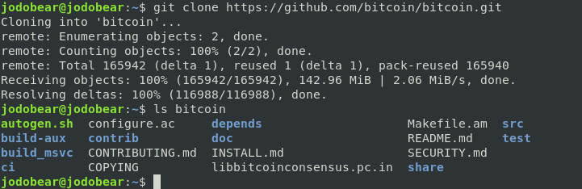
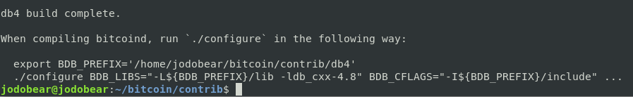

# Apéndice II: Compilando Bitcoin desde la Fuente

Este curso presume que usted usara un programa para crear un entorno Bitcoin,
tanto usando Bitcoin Standup para Linode según
[§2.1](02_1_Configurando_un_Bitcoin-Core_VPS_con_StackScript.md), o vía alguna
otra forma, de acuerdo con [§2.2](02_2_Configurando_Bitcoin_Core_Otros.md). Sin
embargo, usted puede preferir compilar Bitcoin a mano.

Esto tiene los siguientes beneficios:

1. Usted siempre estará actualizado con el ultimo lanzamiento. Consideración:
   Estar siempre actualizado no es necesario para Bitcoin Core, ya que el
   software siempre es retro compatible, esto quiere decir que una versión de
   Bitcoin Core sera capaz de participar en la red Bitcoin, a pesar de no
   contar con las ultimas características.
2. Usted no necesitara depender de binarios pre compilados de Bitcoin Core.
   Esto requiere menos confianza. Aun que los mantenedores de Bitcoin Core
   hacen un gran trabajo manteniendo la integridad del código, un binario pre
   compilado esta unos pasos por detrás del código fuente. Cuando usted compila
   desde el código fuente, el código puede ser inspeccionado antes de la
   compilación.
3. Usted puede personalizar la compilación, haciendo cosas tales como
   deshabilitar los monederos o la interfaz gráfica de usuario.

## Prepare su Entorno

Este tutorial utiliza Debian 10.4.kv0 OS en una arquitectura amd64
(computadoras de 64-bits), pero usted puede usar este tutorial en cualquier
sistema basado en Debian (por ej. Ubuntu, Mint, etc.). Para otros sistemas
Linux, puede adaptar los siguientes pasos con el gestor de paquetes para ese
sistema.

Usted puede tener conocimientos básicos o ninguna familiaridad con la línea de
comandos, siempre y cuando tenga entusiasmo. La terminal es su mas poderoso
aliado, no algo para ser temido. Usted puede simplemente copiar y pegar los
siguientes comandos para compilar bitcoin (un comando con un "$" es un comando
de un usuario común y uno con un "#" es un comando de un superusuario o
administrador).

Si usted no esta en la lista de superusuario entonces haga lo siguiente:

```
$ su root
<enter root passwd>
# apt-get install sudo
# usermod -aG sudo <username>
# reboot
```

## Instale Bitcoin

### Paso 1: Actualice su sistema

Primero, actualice el sistema usando:
```
$ sudo apt-get update
```

### Paso 2: Instale Git y sus dependencias

Instale `git`, el cual le permitirá descargar el código fuente, y
`build-essential`, el cual compila el código:
```
$ sudo apt-get install git build-essential -y
```

Después, instale las dependencias restantes:
```
$ sudo apt-get install libtool autotools-dev automake pkg-config bsdmainutils
python3 libssl-dev libevent-dev libboost-system-dev libboost-filesystem-dev
libboost-chrono-dev libboost-test-dev libboost-thread-dev libminiupnpc-dev
libzmq3-dev libqt5gui5 libqt5core5a libqt5dbus5 qttools5-dev qttools5-dev-tools
libprotobuf-dev protobuf-compiler ccache -y
```

### Paso 3: Descargue el código fuente

Una vez que las dependencias están instaladas, descargue el repositorio (repo)
conteniendo el código fuente de Bitcoin desde github:
```
$ git clone https://github.com/bitcoin/bitcoin.git
```
Verifique el contenido del repo:
```
$ ls bitcoin
````
Debería ser aproximadamente similar al siguiente contenido:



### Paso 4: Instale la base de datos Berkley v4.8

1. Ingrese al directorio `contrib`: `$ cd bitcoin/contrib/`
2. Ejecute el siguiente comando: ```$ ./install_db4.sh `pwd` ```

Una vez que ha sido descargado usted vera la siguiente salida. Tome nota de la
salida, usted lo usara para configurar bitcoin mientras compila:



### Paso 5: Compile Bitcoin Core

Es recomendado que usted compile desde una rama etiquetada, la cual es mas
estable, a menos que usted quiera probar la vanguardia del desarrollo bitcoin.
Ejecute el siguiente comando para obtener una lista de etiquetas, ordenadas de
acuerdo a la mas reciente:
```
$ git tag -n | sort -V
```
Luego elija una etiqueta tal como `v0.20.0`:
```
$ git checkout <TAG>
```

Una vez que ha seleccionado una rama etiquetada, ejecute lo siguiente desde
dentro del directorio `bitcoin`. El `<CAMINO-A>` debe ser la salida del
programa `install_db4.sh`.

```
$ ./autogen.sh
$ export BDB_PREFIX='<PATH-TO>/db4'
$ ./configure BDB_LIBS="-L${BDB_PREFIX}/lib -ldb_cxx-4.8" BDB_CFLAGS="-I${BDB_PREFIX}/include"
$ make  # build bitcoin core
```

### Paso 6: Pruebe la compilación

Si usted quiere comprobar su compilación (lo cual es una buena idea), ejecute
las siguientes pruebas:

1. `$ make check` correra las pruebas unitarias, los cuales deberan retornar `PASS`.
2. `$ test/functional/test_runner.py --extended` ejecutara las pruebas
   funcionales extendidas. Omita el indicador `--extended` si usted quiere
   evitar algunas pruebas. Esto puede tomarle bastante tiempo.

### Paso 7: Ejecute e instale Bitcoin Core

Ahora que usted ha compilado Bitcoin Core desde la fuente, usted puede empezar
a usarlo e instalarlo para una disponibilidad global.

#### Ejecute Bitcoin Core sin instalarlo

Para solo ejecutar Bitcoin Core:

`$ src/qt/bitcoin-qt` para ejecutar la interfaz grafica de usuario.
`$ src/bitcoind` para ejecutar bitcoin en la línea de comandos.

### Instale Bitcoin Core

Para instalar:

`$ sudo make install` instalara bitcoin core globalmente. Una vez instalado
usted puede entonces ejecutar bitcoin desde cualquier lugar en la línea de
comandos, al igual que con cualquier otro software: `$ bitcoin-qt` para la
interfaz grafica de usuario o `bitcoind` y luego `bitcoin-cli` para la línea de
comandos.

## Finalice su sistema

Compilando Bitcoin desde la fuente, usted disminuye la necesidad de confianza
en su configuracion. Sin embargo, usted esta lejos de la seguridad adicional
provista por la configuracion de Bitcoin Standup. Para resolver esto, usted
puede querer recorrer el programa 
[Linode Stackscript](https://github.com/BlockchainCommons/Bitcoin-Standup-Scripts/blob/master/Scripts/LinodeStandUp.sh)
completo y ejecutar paso a paso todos los comandos. El unico lugar donde
necesita ser cuidadoso es en el Paso 6, el cual instala Bitcoin. Omita solo
hasta donde verifica sus binarios, y continue desde ahi.

## Resumen: Compilando Bitcoin desde la Fuente

Si usted quiere la seguridad incrementada de instalar Bitcoin desde la fuente,
usted deberia tenerla ahora. Con un poco de suerte, usted tambien habra
recorrido el Linode Stackscript para configurar un servidor mas seguro.

## ¿Que sigue?

Si usted estaba en el proceso de crear un nodo Bitcoin para usar en este curso, usted deberia continuar con 
[Capitulo 3: Entendiendo Su Configuración Bitcoin](03_0_Entendiendo_Su_Configuracion_Bitcoin.md).

Si usted esta leyendo a través de los apéndices, continúe con 
[Apéndice III: Usando Bitcoin Regtest](A3_0_Usando_Bitcoin_Regtest.md).

